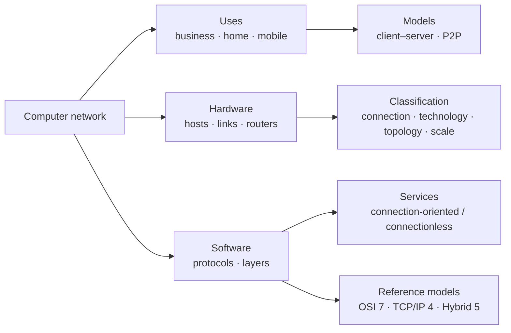

# 01 · Introduction to Computer Networks

> [!info] Lesson map
> **Source:** Lecture deck *Chapter 01 – Introduction* (Dr. VGTN Vidanagama, 182 slides, delivered as L1–L3) · [[00. CMIS 3114 Course Overview|Course Overview]]
> **Exam priority:** 🔴 **High.** Chapter 1 supplies roughly **37%** of all past-paper sub-questions. Q1, Q2 and Q3 of every 8-question paper come almost entirely from this chapter.
> **Past questions:** [[PP 01.1 - Networks, Uses and Distributed Systems|PP 01.1]] · [[PP 01.2 - Mobile Computing, IoT and Wireless|PP 01.2]] · [[PP 01.3 - Social and Technical Essays|PP 01.3]] · [[PP 01.4 - Classification and Topologies|PP 01.4]] · [[PP 01.5 - Protocols, Layering and Services|PP 01.5]] · [[PP 01.6 - Reference Models, TCP and UDP|PP 01.6]]
> **Quick revision:** [[01.99 Summary - Introduction]]

## What this lesson is about

Chapter 1 answers three big questions:
1. **What is a network and why do we build one?** (definition, uses, distributed systems, client–server vs P2P, mobile users, social issues)
2. **What is a network physically made of, and how do we classify networks?** (hardware, transmission technology, topology, scale: BAN/PAN/LAN/MAN/WAN)
3. **How is network software organised?** (protocols, layering, services, the OSI and TCP/IP reference models)

It finishes with real examples (ARPANET, the Internet, Ethernet, WiFi) and the standards bodies.

## Topic structure (from the lecture's chapter overview)

```text
1.1 Introduction
├── Computer network · Internet vs Web · Distributed system
├── Why network? · Problems · What a network does
└── Uses: business (client–server) · home (P2P) · mobile users · social issues
1.2 Network Hardware
├── Components: hosts, routers/switches/bridges, links
├── Type of connection: dedicated · shared medium · switched point-to-point
├── Transmission technology: broadcast vs point-to-point (unicast / broadcast / multicast)
├── Topology: bus · star · ring · full mesh · partial mesh · tree
├── Scale: BAN · PAN · LAN · MAN · WAN
└── Wireless networks: system interconnection · wireless LAN · wireless WAN
1.3 Network Software
├── Protocols · layering · protocol hierarchies (peers, interfaces)
├── Message through the layers · network architecture · protocol stack
├── Design issues for the layers
├── Connection-oriented vs connectionless services · service types
├── Service primitives (LISTEN … DISCONNECT, phases 1–9)
└── Services vs protocols · layering pros/cons
1.4 Reference Models: OSI (7) · TCP/IP (4) · comparison · why OSI failed · hybrid (5)
1.5 Example Networks: ARPANET · NSFNET · Internet architecture · Ethernet · 802.11
1.6 Network Standardization: ISO, ANSI, NIST, IEEE, IAB · IEEE 802.x
```

## Notes in this lesson

| # | Note | Exam weight (papers out of 6) |
|---|---|---|
| 1 | [[01.01 Computer Networks]] | 🔴 6/6 (define, reasons, advantages) |
| 2 | [[01.02 Distributed Systems]] | 🔴 5/6 |
| 3 | [[01.03 Uses of Computer Networks]] | 🔴 6/6 (uses, applied scenarios) |
| 4 | [[01.04 Client-Server and Peer-to-Peer Models]] | 🔴 4/6 |
| 5 | [[01.05 Mobile Computing and Wireless Networks]] | 🔴 5/6 |
| 6 | [[01.06 Social Issues of Computer Networks]] | 🔴 5/6 (Q1(d) essay) |
| 7 | [[01.07 Network Hardware and Transmission Technology]] | 🔴 classification 5/6 |
| 8 | [[01.08 Network Topologies]] | 🔴 6/6 |
| 9 | [[01.09 Network Classification by Scale]] | 🔴 (3 papers on scale + 2 on technology) |
| 10 | [[01.10 Protocols and Layering]] | 🔴 6/6 |
| 11 | [[01.11 Protocol Hierarchies and Encapsulation]] | 🟡 3/6 |
| 12 | [[01.12 Design Issues for the Layers]] | 🟢 1/6 |
| 13 | [[01.13 Connection-Oriented and Connectionless Services]] | 🔴 (with 01.14) |
| 14 | [[01.14 Service Primitives]] | 🔴 3/6, identical wording, incl. 2023/24 |
| 15 | [[01.15 OSI Reference Model]] | 🔴 |
| 16 | [[01.16 TCP-IP Reference Model]] | 🔴 TCP vs UDP 3/6 incl. 2023/24 |
| 17 | [[01.17 OSI vs TCP-IP and the Hybrid Model]] | 🔴 3/6 incl. 2023/24 |
| 18 | [[01.18 Example Networks]] | 🟢 0/6 (supports Telephone vs Internet) |
| 19 | [[01.19 Network Standardization]] | 🟢 0/6 |
| 20 | [[01.20 IoT, Smart Homes and Emerging Topics]] | 🔴 5/6 ⚠️ *not in the slides* |
| ★ | [[01.99 Summary - Introduction]] | Revision |

## How the pieces connect



**Reading the diagram:** a network has a *purpose* (uses and models), a *physical form* (hardware, classified four ways) and a *logical organisation* (protocols arranged in layers). The rest of the course (Chapters 2–5) zooms into the lower layers one at a time: [[02.00 Physical Layer]] → [[03.00 Data Link Layer]] → [[04.00 MAC Sublayer]] → [[05.00 Network Layer]].

> [!tip] Exam pattern for this chapter
> - **Q1** = definition / reasons / uses + distributed system or P2P vs client–server + two short notes (mobile computing + IoT/smart home) + one essay (Q1(d)).
> - **Q2** = classification (scale **or** transmission technology) + two topologies + Telephone network vs Internet / WLAN / Li-Fi / MANET + connection-oriented client–server steps.
> - **Q3** = protocol definition + layering reasons + TCP vs UDP **or** message through layers + OSI vs TCP/IP **or** physical/virtual diagram.

## Related
- Old stub note (kept unchanged): [[3114-01 Introduction]]
- Earlier Chapter 1 Q&A: [[3114 Ch01 Past Paper Q&A]]
