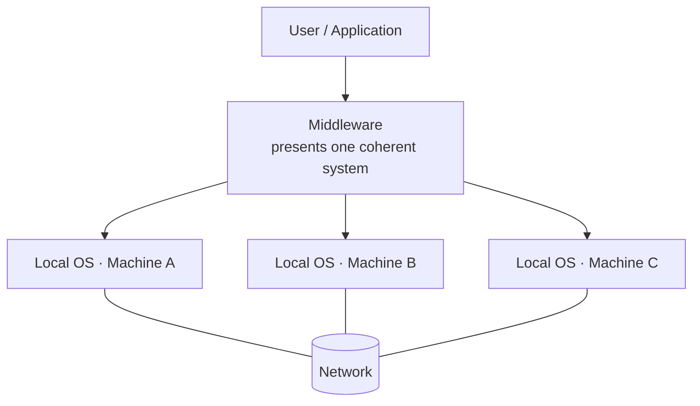

# 01.02 · Distributed Systems

> [!info] [[01.00 Introduction|Lesson 1]] · Lecture ref Ch1 §1.1 (slides 12–13) · Priority 🔴 High (5/6 papers)
> **Asked as:** "Describe the differences between Distributed systems and client-server systems" (2018/19 Q1b) · "Describe what is a Distributed System and its advantages and disadvantages giving an example" (2020/21 Q1b) · short note (2021/22 Q1c(i), 2022/23 Q1c(i)) · "Explain with a diagram what is a Distributed System…" (2023/24 Q1b)

## 1. What is it?

**Simple English:** many separate computers work together, but to the user they look like **one single computer**.

**Lecture definition:** *"In a distributed system, a collection of **independent computers appears to its users as a single coherent system**."*

Key points from the slides:
- A distributed system is a **software system built on top of a network**.
- It usually presents **a single model or paradigm** to the users.
- A layer of software on top of the operating system, called **middleware**, implements this model.
- Example: the **World Wide Web**, where *everything looks like a document (web page)*. The Web is a distributed system that **runs on top of the Internet**.

## 2. Why is it needed?
A single computer has limits in power, storage and reliability. A distributed system **combines many machines** but **hides the complexity**: the user does not need to know which machine stores the file or does the work.

## 3. How does it work?

**Explanation:** each machine runs its own OS. The **middleware** layer sits above all of them and makes the group look like one system. The machines talk through the **network** underneath. This is the diagram to draw for 2023/24 Q1(b).

## 4. Distributed system vs computer network

| | Computer network | Distributed system |
|---|---|---|
| What the user sees | The **actual machines**; must log in to / address a specific machine | **One coherent system**; machines are hidden |
| Coherence/model | *"This coherence, model, and software are absent"* | A **single model or paradigm** |
| Built from | Hardware + protocols | **Software (middleware) on top of a network** |
| Example | A LAN of office PCs | The **World Wide Web**, Google Drive |

## 5. Advantages and disadvantages

> [!note] Additional explanation (beyond the slides)
> The lecture gives the definition and the Web example only. The advantage/disadvantage lists below are standard textbook points, needed because 2020/21 and 2023/24 ask for them.

| Advantages | Disadvantages |
|---|---|
| **Resource sharing** across many machines | **Complex** software (middleware) to design and debug |
| **Reliability / fault tolerance**: one machine fails, others continue | **Security**: more machines and links to protect |
| **Scalability**: add machines as demand grows | **Network dependency**: slow or broken network → system slow/unavailable |
| **Performance**: work done in parallel | **Consistency** problems keeping copies of data identical |
| **Transparency**: users see one system | Higher **cost** of setup and management |

## 6. Examples
- **World Wide Web** (lecture example): pages on millions of servers appear as one linked set of documents.
- **Google Drive / cloud storage**: your file is stored on many servers in different countries, but you just see "My Drive".
- **Online banking / ATM network**: many servers act as one banking system.

## 7. Distributed system vs client–server system (2018/19 Q1b)

| Distributed system | Client–server system |
|---|---|
| Many independent computers **appear as one** | Clearly separate roles: **clients request, servers reply** |
| Location of data/processing is **hidden** (transparency) | Client knows which **server** it contacts |
| Work and data spread across **many peers/nodes** | Data is **centralised on powerful servers** |
| Middleware gives a single model | Request–reply between **two processes** |

Client–server is often *one way of building* parts of a distributed system. See [[01.04 Client-Server and Peer-to-Peer Models]].

## 8. Exam relevance
- 🔴 5/6 papers. Expect: **definition + diagram + 2–3 advantages + 2–3 disadvantages + Web example**.
- Write the lecture sentence exactly: *"a collection of independent computers appears to its users as a single coherent system."*

## Related
[[01.01 Computer Networks]] · [[01.04 Client-Server and Peer-to-Peer Models]] · [[PP 01.1 - Networks, Uses and Distributed Systems]]
