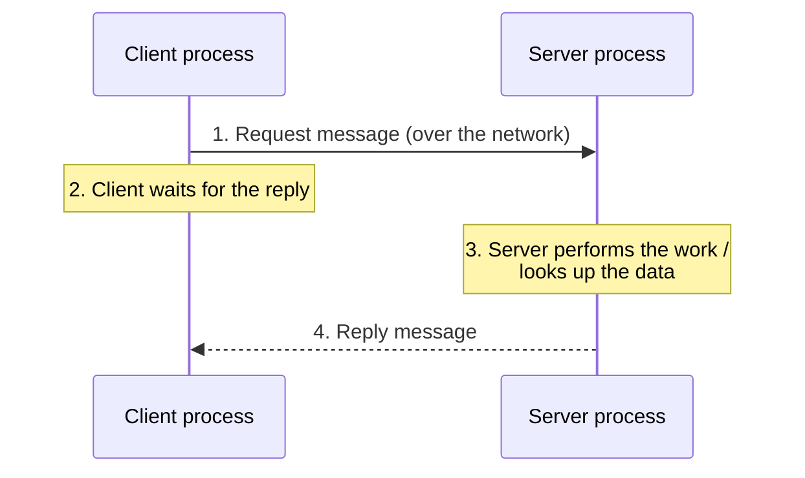
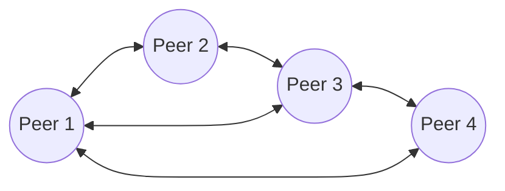

# 01.04 · Client–Server and Peer-to-Peer Models

> [!info] [[01.00 Introduction|Lesson 1]] · Lecture ref Ch1 §1.1 (slides 25–28, 34–37) · Priority 🔴 High (4/6 papers)
> **Asked as:** "Compare and contrast between Peer-to-Peer and Client-Server network models" (2019/20 Q1b) · "What are the differences and similarities between Peer-to-Peer and Client-Server network models?" (2022/23 Q1b) · short note on P2P networks (2020/21 Q1c(ii)) · distributed vs client–server (2018/19 Q1b)

## 1. Client–server model

**Simple English:** some computers (servers) hold the data and do the work; other computers (clients) ask them for it.

From the lecture:
- Data are stored on **powerful computers called servers**, often **centrally housed and maintained by a system administrator**.
- Employees have **simpler machines called clients** on their desks to access remote data.
- **Two processes** are involved: one on the client machine and one on the server machine.
- The model involves **requests and replies**.

### How it works (step by step)

1. The client process **sends a request message** over the network to the server process.
2. The client process **waits** for a reply.
3. The server receives the request and **performs the requested work or looks up the requested data**.
4. The server **sends back a reply**.

**Example (lecture):** when you access a web page from home, the remote **web server** is the server and your **PC** is the client.

## 2. Peer-to-peer (P2P) model

From the lecture:
- *"Individuals who form a loose group can communicate with others in the group."*
- *"Every person can, in principle, communicate with one or more other people; there is **no fixed division into clients and servers**."*
- *"Each host can act as **both client and server**"* (e.g. **BitTorrent**).
- Online auctions / electronic flea markets are *"more of a peer-to-peer system, sort of consumer-to-consumer."*

**Explanation:** every peer both downloads from and uploads to other peers. In BitTorrent, while you download a file in pieces from many peers, you also upload the pieces you already have.

## 3. Comparison (the exam table)

| Feature | Client–server | Peer-to-peer |
|---|---|---|
| Roles | **Fixed**: clients request, servers serve | **No fixed roles**: every host is client **and** server |
| Data storage | **Centralised** on servers | **Distributed** across peers |
| Control/administration | Central, by a **system administrator** | Each user manages own machine; **no central control** |
| Security | Easier: one place to protect, back up, control access | Harder: each peer must protect itself |
| Cost | Higher: powerful servers, admin staff | Low: uses existing machines |
| Scalability | Server can become a **bottleneck** as clients grow | Scales well: more peers = more capacity |
| Reliability | Server is a **single point of failure** | No single point of failure |
| Examples | Web browsing, e-mail, online banking, company databases | **BitTorrent**, Skype (early versions), C2C online auctions, file sharing in a small office |

**Similarities (for "compare / similarities" questions):**
- Both are **models for sharing resources and communicating over a network**.
- Both use the **same underlying network and protocols** (e.g. TCP/IP).
- In both, communication is between **processes** exchanging messages (requests/replies).
- Both support e-commerce and person-to-person communication.

> [!note] Additional explanation (beyond the slides)
> The rows on cost, scalability, reliability and security are standard textbook comparisons. The lecture itself gives the defining features: servers vs clients, request–reply, "no fixed division", "each host acts as both", BitTorrent.

## 4. Exam relevance
- 🔴 Appears in 4/6 papers as a compare/contrast or short note.
- Always give **definition of each + a 5–6 row table + 2 similarities + an example of each.**

## Related
[[01.02 Distributed Systems]] · [[01.03 Uses of Computer Networks]] · [[01.14 Service Primitives]] (connection-oriented client–server interaction) · [[PP 01.1 - Networks, Uses and Distributed Systems]]
