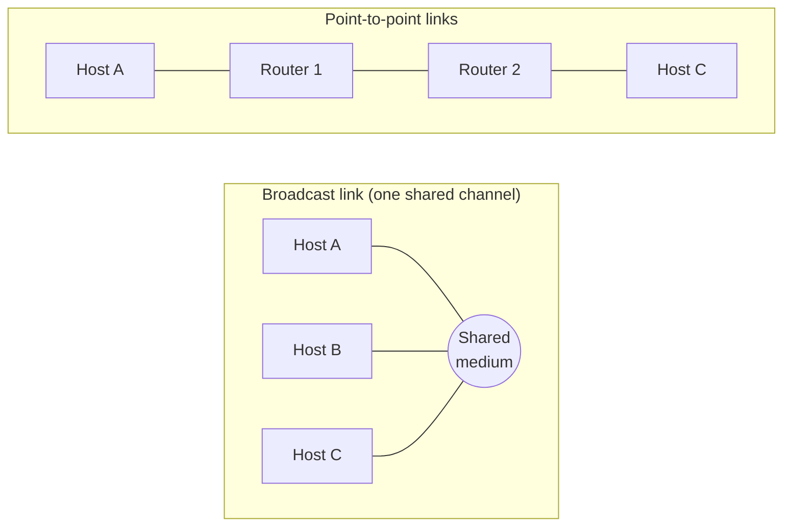

# 01.07 · Network Hardware, Type of Connection and Transmission Technology

> [!info] [[01.00 Introduction|Lesson 1]] · Lecture ref Ch1 §1.2 (slides 47–52) · Priority 🔴 High
> **Asked as:** "Classify computer networks according to the transmission technology" (2020/21 Q2a, 2022/23 Q2a)

## 1. What a network includes (components)

| Component | Role (lecture) |
|---|---|
| **Transmission hardware** | The links: twisted pair, coaxial cable, fibre, radio… |
| **Special-purpose hardware devices** | Interconnect transmission media, control transmission, run protocol software (routers, switches, bridges) |
| **Protocol software** | Encodes and formats data; detects and corrects problems |

Data network components: **end systems (hosts)**, **routers/switches/bridges**, and **links**.

> [!note] Additional explanation: common devices (beyond the slides, needed for design questions)
> | Device | Layer | What it does |
> |---|---|---|
> | **Hub** | Physical | Repeats every bit to every port (one shared collision domain) |
> | **Switch / bridge** | Data link | Forwards frames only to the port of the destination **MAC address** (learns addresses) |
> | **Router** | Network | Forwards packets between **different networks** using IP addresses and routing tables |
> | **Access point** | Data link (wireless) | Connects WiFi stations to the wired LAN |
> | **Firewall** | Network/transport+ | Filters traffic by rules to protect the network |

## 2. Classification by type of connection

| Type | Properties (lecture) | Picture it as |
|---|---|---|
| **1. Dedicated link** | Fixed bandwidth · route fixed at setup · **idle capacity wasted** | A private line between two sites |
| **2. Shared medium (multiple access)** | Many stations share one channel → **congestion problems** | Old Ethernet bus, WiFi |
| **3. Switched point-to-point** | Many connections between individual pairs of machines; **multiple routes of different lengths**; a packet may visit **one or more intermediate machines** (routers) | The Internet |

## 3. Classification by transmission technology (exam question)

**Packets:** *"the 'chunk' of data transmitted from one machine to the next."*

### (a) Broadcast links
- A **single communication channel shared by all machines** on the network.
- A packet sent by any machine is **received by all the others**.
- An **address field** in the packet specifies the intended recipient. *"Upon receiving a packet, a machine checks the address field. If the packet is intended for the receiving machine, that machine processes the packet; if the packet is intended for some other machine, it is just ignored."*
- Example: a WiFi network, classic Ethernet bus.

**Addressing modes on broadcast links:**

| Mode | Who processes the packet |
|---|---|
| **Unicast (one to one)** | Only the machine whose specific address is in the packet |
| **Broadcast** | **All** machines on the network |
| **Multicast** | A **subset** (group) of machines |

### (b) Point-to-point links
- **Individual connections between pairs of machines.**
- To reach the destination a packet may have to visit **intermediate machines** (routers); **routing** (finding a good path) is important.
- Example: WAN links between routers, a leased line.

> [!tip] Rule of thumb (Tanenbaum)
> Smaller, geographically localised networks tend to use **broadcasting**; larger networks usually use **point-to-point** links. *(Additional explanation from the reference textbook.)*

## 4. Exam relevance
- 🔴 "Classify by transmission technology" → **broadcast vs point-to-point**, define each, explain the **address field check**, list **unicast / broadcast / multicast**, give examples. A diagram helps.
- Do not confuse it with classification **by scale** ([[01.09 Network Classification by Scale]]) or **by topology** ([[01.08 Network Topologies]]).

## Related
[[01.08 Network Topologies]] · [[01.09 Network Classification by Scale]] · [[04.00 MAC Sublayer]] (broadcast channels) · [[05.01 Network Layer Design Issues]] (point-to-point, store-and-forward) · [[PP 01.4 - Classification and Topologies]]
