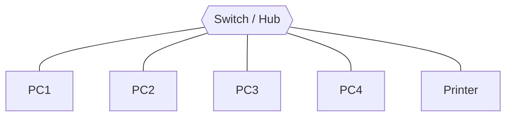
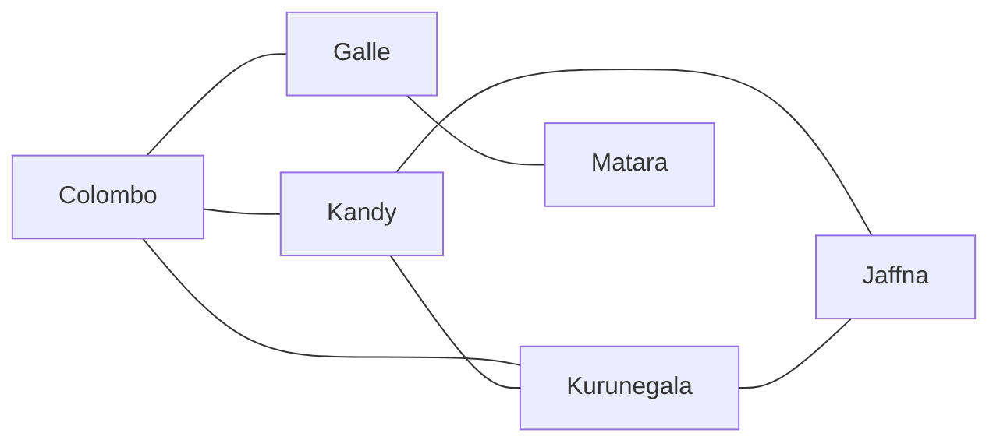
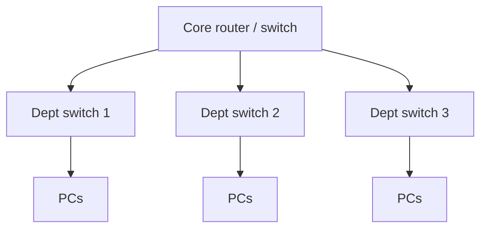

# 01.08 · Network Topologies

> [!info] [[01.00 Introduction|Lesson 1]] · Lecture ref Ch1 §1.2 (slides 53–58) · Priority 🔴 High (**6/6 papers**)
> **Asked as:** backbone between cities + lab of 100 PCs (2018/19 Q2b) · star vs partial mesh (2019/20 Q2b, 2021/22 Q2b) · three topologies with diagrams and usages (2020/21 Q2b) · ring + partial mesh with device, media, usage (2022/23 Q2b) · ring + star (2023/24 Q2b) · most suitable topology for a faculty/office network (2019/20 Q8a, 2022/23 Q8a)

## 1. What is it?
**Lecture:** network topology is *"the way network elements are interconnected (the **physical layout** of the network)."*

## 2. The six topologies

### Bus
*"A set of clients are connected via a **shared communications line**."*
```text
 [PC1]   [PC2]   [PC3]   [PC4]
   |       |       |       |
 ==+=======+=======+=======+==  ← single backbone cable (terminators at both ends)
```
- **Devices/media:** coaxial cable with T-connectors and terminators (classic Ethernet 10Base2).
- **Usage:** early Ethernet LANs, small temporary networks.
- ✅ cheap, little cable · ❌ one cable break stops everyone; collisions; hard to troubleshoot.

### Star
*"Nodes are connected to a **central node** with a point-to-point link. All data transmitted between nodes is transmitted to this central node,"* which *"retransmits the data to some or all of the other nodes."*

- **Devices/media:** **switch** (or hub) + **UTP twisted pair** (Cat5e/Cat6) or WiFi access point.
- **Usage:** **computer labs, offices, home networks**; almost every modern LAN.
- ✅ easy to add/remove nodes; one cable failure affects only one node; easy to manage and troubleshoot · ❌ **central device is a single point of failure**; more cable than bus.

### Ring
*"Each node is connected to **two other nodes**,"* with first and last connected, *"forming a ring."* Data travels *"from one node to the next in a circular manner,"* *"generally in a single direction only."*
```text
   [A] ──► [B]
    ▲        │
    │        ▼
   [D] ◄── [C]
```
- **Devices/media:** **Token Ring (IEEE 802.5)** with MAU, twisted pair; **fibre rings** (FDDI, SONET) with **active repeaters** (see [[02.01 Guided Transmission Media]]).
- **Usage:** Token Ring LANs, **metropolitan fibre rings / backbones**.
- ✅ orderly access with a token (no collisions, see [[04.04 Collision-Free Protocols]]); fair · ❌ one node/link failure can break the ring (unless dual ring); adding nodes disrupts the network.

### Mesh (fully connected)
*"Each node is connected to **each of the other nodes** with a point-to-point link,"* so data can be sent *"simultaneously from any single node to all of the other nodes."*
- Links needed for $n$ nodes: $\dfrac{n(n-1)}{2}$. For 5 nodes → 10 links; for 100 nodes → 4,950 links.
- **Usage:** small critical networks, core of military/financial networks.
- ✅ maximum redundancy and reliability; no traffic sharing · ❌ very expensive; complex cabling.

### Mesh (partially connected)
*"Some of the nodes are connected to **more than one** other node,"* to *"take advantage of some of the redundancy… without the expense and complexity required for a connection between every node."*

- **Devices/media:** **routers** connected by **optical fibre** (or microwave) WAN links.
- **Usage:** **national/ISP backbones connecting cities, the Internet**.
- ✅ redundancy (alternative routes) at lower cost than full mesh · ❌ still costly; needs routing.

### Tree (hierarchical)
A central **root** node connects to second-level nodes, each of which connects to lower-level nodes (a hierarchy of stars).

- **Usage:** **campus/faculty/company networks** with departments.
- ✅ scalable, easy to manage by department · ❌ root failure affects all; more cable.

## 3. Comparison table

| Topology | Cost | Reliability | Easy to expand | Typical use |
|---|---|---|---|---|
| Bus | Lowest | Low (backbone break) | Moderate | Early Ethernet |
| Star | Moderate | Good (except central device) | **Easy** | Labs, offices |
| Ring | Moderate | Low (single ring) | Hard | Token Ring, fibre MAN rings |
| Full mesh | **Highest** | **Highest** | Hard | Small critical cores |
| Partial mesh | High | High | Moderate | **Backbones between cities**, Internet |
| Tree | Moderate | Moderate (root) | Easy | Campus/faculty networks |

## 4. Applied questions: choosing a topology

| Scenario | Best choice | Why |
|---|---|---|
| Backbone connecting major cities (2018/19) | **Partial mesh** | Redundant paths if a link fails; full mesh too expensive over long distances |
| Lab with 100 computers (2018/19) | **Star** (or **extended star / tree** with several switches) | Easy management, a faulty PC/cable affects one machine, switches are cheap |
| Faculty with departments interconnected via ICT (2019/20 Q8a), office via IT Service dept (2022/23 Q8a) | **Tree (hierarchical / extended star)** | Each department is a star LAN; all connect to a central ICT/IT switch-router that holds the servers and the ISP link |

## 5. Exam relevance
- 🔴 Every paper. For each topology asked: **definition (lecture wording) + diagram + device + media + usage + 1–2 pros/cons.**
- Practise drawing: [[PP 01.4 - Classification and Topologies]], design scenarios [[PP 05.4 - Network Design Scenarios]].

## Related
[[01.07 Network Hardware and Transmission Technology]] · [[01.09 Network Classification by Scale]] · [[02.01 Guided Transmission Media]] · [[04.04 Collision-Free Protocols]] (token passing)
