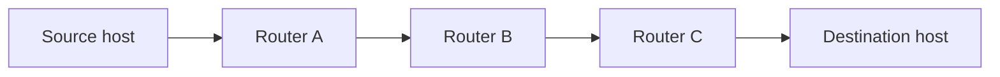

# 01.09 · Classification by Scale: BAN, PAN, LAN, MAN, WAN

> [!info] [[01.00 Introduction|Lesson 1]] · Lecture ref Ch1 §1.2 (slides 59–73) · Priority 🔴 High
> **Asked as:** "Classify computer networks according to the geographical coverage" (2019/20 Q2a, 2021/22 Q2a) · "…according to the geographical scale" (2023/24 Q2a)

## 1. Idea
Networks are classified by **how far apart the interconnected processors are**: from devices on one body to the whole world.

| Interprocessor distance | Processors located in same… | Example |
|---|---|---|
| 1 m | Square metre | **Personal area network** |
| 10 m | Room | **Local area network** |
| 100 m | Building | **Local area network** |
| 1 km | Campus | **Local area network** |
| 10 km | City | **Metropolitan area network** |
| 100 km | Country | **Wide area network** |
| 1000 km | Continent | **Wide area network** |
| 10,000 km | Planet | **The Internet** |

*(This is the Tanenbaum table shown as an image on slide 59.)*

## 2. Each type

### BAN: Body Area Network
Network of **wearable devices**: a PDA/smartphone controlling a hearing aid; sensors monitoring **heart rate / blood glucose**.

### PAN: Personal Area Network
*"Networks that are meant for **one person**."* Example: a **wireless network connecting a computer with its mouse, keyboard and printer** (Bluetooth, IEEE 802.15).

### LAN: Local Area Network
*"Networking capabilities within a **building, campus**."* LANs are:
- **privately owned**; up to **several kilometres**
- **restricted in size** so the worst-case transmission time is bounded
- fast: **10, 100, 1000 or more Mbps**
- **low delay, high reliability**
- used to connect PCs and workstations in offices and factories to **share resources** (printers) and exchange information

**Types of LAN (lecture):**

| LAN | Standard | Description |
|---|---|---|
| **Ethernet** | **IEEE 802.3** | **Bus-based broadcast** network, **decentralised control**, 10 or 100 Mbps. Computers transmit whenever they want; *"if two or more packets collide, each computer just waits a random time and tries again later."* |
| **Token Ring** | **IEEE 802.5** | **Ring-based broadcast** network with **token arbitration**, 4 or 16 Mbps. A special **token frame circles the loop**; a station that needs to send converts the token into a data frame; when its own frame returns it converts it back into a token. |

### MAN: Metropolitan Area Network
*"A larger version of a LAN which covers a **city**."* MANs are public or private, carry data or voice, can be distinguished from LANs by the **wiring mechanism**, and are **broadcast (no switches)**. Example: a MAN **based on cable TV**, typically **500 to 5,000 homes** (see [[02.12 Cable Television and Internet over Cable]]).

### WAN: Wide Area Network
Spans **greater geographic distances (e.g. world-wide)**. *"A WAN consists of several **transmission lines and routers**. The **Internet** is an example of a WAN."*

WAN vocabulary (lecture):
| Term | Meaning |
|---|---|
| **Hosts / end systems** | Machines running user (application) programs; owned by customers |
| **Communication subnet** | Transmission lines + switching elements; owned by a telephone company or ISP; *"carries messages from host to host"* |
| **Transmission lines** (circuits, channels, trunks) | Move bits; copper, fibre, radio |
| **Switching elements / routers** (packet-switching nodes, intermediate systems) | Specialised computers connecting three or more lines; choose an outgoing line for arriving data |

#### How data crosses a WAN: store-and-forward (step by step)
1. A process on the source host has a message; the host **cuts the message into packets**, each numbered in sequence.
2. Packets are **injected into the network one at a time** in quick succession.
3. At each intermediate router the packet is **received in its entirety, stored until the required output line is free, then forwarded**.
4. **Routing decisions are made locally**: when a packet arrives at router A, A decides whether to send it on the line to B or to C.
5. Packets travel **individually** and are deposited at the receiving host, where they are **reassembled** into the original message.

*"A subnet organised according to this principle is called a **store-and-forward** or **packet-switched** subnet."* More: [[05.01 Network Layer Design Issues]].

## 3. Comparison: LAN vs MAN vs WAN

| Feature | LAN | MAN | WAN |
|---|---|---|---|
| Coverage | Room → building → campus (≤ few km) | City (~10 km) | Country → world |
| Ownership | Private | Public or private | Usually public / leased (telco, ISP) |
| Speed | High (100 Mbps – Gbps) | Medium–high | Lower per link, varies |
| Delay / errors | Low delay, high reliability | Moderate | Higher delay, more errors |
| Technology | Ethernet 802.3, WiFi 802.11, Token Ring 802.5 | Cable TV / HFC, fibre rings, WiMAX 802.16 | Routers, fibre, satellite, store-and-forward |
| Example | University lab | City cable-TV network | **The Internet**, a bank's national network |

## 4. Exam relevance
- 🔴 Asked in 3 papers (scale) and 2 more (technology). Answer: **list BAN, PAN, LAN, MAN, WAN with distance, ownership, example**, then the comparison table. Mention **Ethernet and Token Ring** under LAN, and **store-and-forward** under WAN.

## Related
[[01.07 Network Hardware and Transmission Technology]] · [[01.08 Network Topologies]] · [[01.05 Mobile Computing and Wireless Networks]] · [[05.01 Network Layer Design Issues]] · [[PP 01.4 - Classification and Topologies]]
