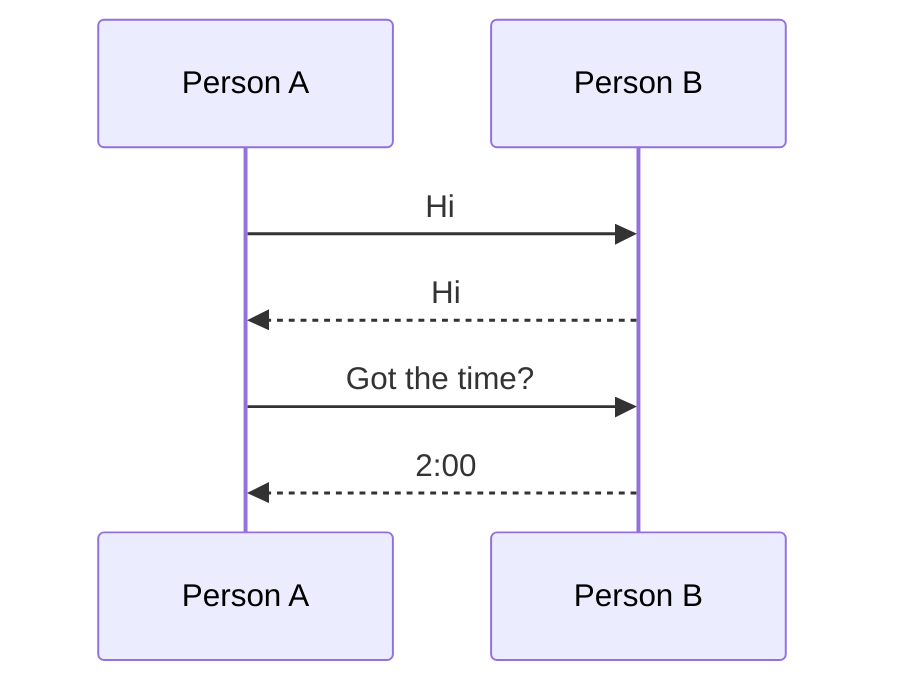
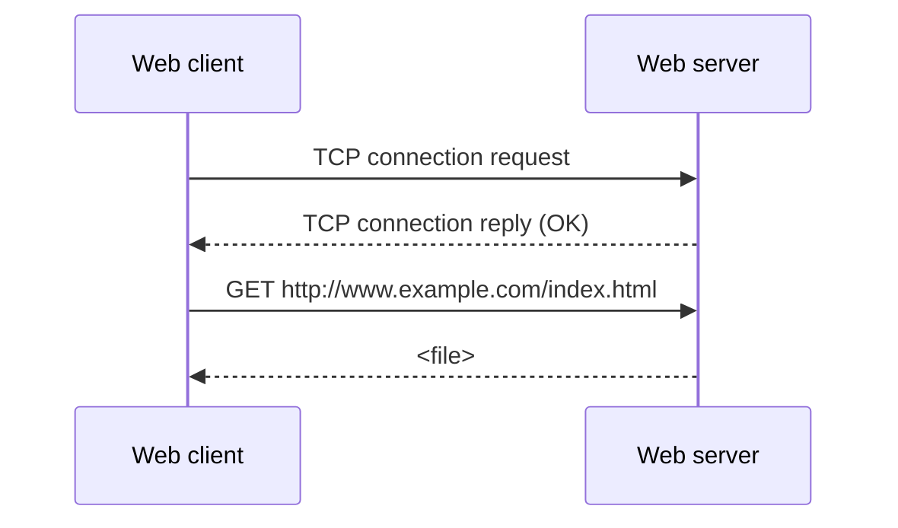

# 01.10 · Protocols and Layering

> [!info] [[01.00 Introduction|Lesson 1]] · Lecture ref Ch1 §1.3 (slides 78–83, 118) · Priority 🔴 High (**6/6 papers**)
> **Asked as:** "Describe the role of protocols" (2018/19 Q2a) · "what is a network protocol and why they are needed" (2019/20, 2021/22, 2023/24 Q3a) · "need for network protocols and why multiple protocols are used" (2022/23 Q3a) · "why network protocols are designed with a layered approach" (2018/19 Q3a, 2020/21 Q3a) · "List two reasons for using layered protocols. Describe one possible disadvantage" (2019/20, 2021/22, 2023/24 Q3b)

## 1. What is a protocol?

**Simple English:** a protocol is an agreed set of rules for a conversation, so both sides understand each other.

**Lecture definitions:**
- *"An agreement, standard or a set of rules on the conversation."*
- *"A communication protocol is a **set of rules that specify the format and meaning of messages** exchanged between computers across a network."*
- *"A set of related protocols that are designed for compatibility are called a **protocol suite** or **protocol hierarchy**."*
- Later (§1.3): *"A protocol is a set of rules governing the **format and meaning** of the packets, or messages, that are exchanged by **peer entities** within a layer."*

### Human protocol vs computer protocol (lecture picture)



**Explanation:** in both cases the parties follow agreed rules about **what to send, in what order, and what each message means**. If one side breaks the rules (e.g. answers "2:00" before being greeted, or sends data in an unknown format), communication fails.

## 2. Why are protocols needed? (the role of protocols)
Protocols make communication possible between machines built by **different vendors, running different software**. They define:
1. **Format (syntax)** of messages: which fields, in what order, what size.
2. **Meaning (semantics)**: what each field/message means and what action to take.
3. **Timing / order**: who speaks when, what reply is expected (e.g. request → reply, ACKs).
4. **Error handling**: detecting and recovering from corrupted, lost, duplicated or out-of-order data.
5. **Addressing**: identifying sender and receiver.

Without agreed protocols there would be no **interoperability**: this is also why networks have so many **standards** ([[01.19 Network Standardization]]).

### Why are *multiple* protocols used? (2022/23 Q3a)
Networking is too complex for one protocol. The problem is divided into layers and **each layer has its own protocol** solving one part: e.g. HTTP (application), TCP (reliable transport), IP (routing), Ethernet (link), and the physical signalling. Different needs also need different protocols at the same layer: **TCP** for reliable transfer, **UDP** for fast real-time traffic. The set of protocols used (one per layer) is the **protocol stack** ([[01.11 Protocol Hierarchies and Encapsulation]]).

## 3. What is layering?

**Problem:** *"Networks are complex with many pieces: hosts, routers, links, applications, protocols, hardware, software."* Consider a web page request: the browser requests the page, the server checks access rights, the page must be transferred reliably, and bits must physically move.

**Approach: "divide and conquer".** *"Split job into smaller jobs, or layers."*

Lecture points:
- The model *"divides the network protocols into layers, each of which solves **part** of the network communication problem."*
- Networks are organised as a **stack of layers**, each built upon the one below it.
- *"The purpose of each layer is to **offer certain services to the higher layers**, shielding those layers from the details of how the offered services are actually implemented."*
- *"A particular piece of software (or hardware) provides a service to its users but **keeps the details of its internal state and algorithms hidden**."*
- Analogies: **building a house** (digging, foundation, framing), a **car assembly line**: *"each step dependent on the previous step but does not need to be aware of how the previous step was done."*
- *"There is **no physical transfer of data across layers**"* (except at the bottom).
- *"Each layer is independent ⇒ one layer can be changed without affecting others"*, e.g. *"if the secretary uses e-mail instead of fax it doesn't affect rest of system."*

### The philosopher–translator–secretary analogy (slide 79)
```text
 Location A                                  Location B
 Philosopher (L3)  "I like rabbits"  ·····►  Philosopher (L3)   ← peers talk about ideas
 Translator  (L2)  Dutch / English   ·····►  Translator  (L2)   ← agree on a common language
 Secretary   (L1)  fax / e-mail      ─────►  Secretary   (L1)   ← physical delivery
```
Each layer talks to its **peer** using its own protocol (dotted = virtual), but the message really passes **down** to the secretary, across the fax line, and **up** at the other side. The translators can switch from Dutch to Finnish, or the secretaries from fax to e-mail, **without the philosophers noticing**: that is layer independence.

## 4. Advantages and disadvantages of layering (lecture slide 118)

| Advantages | Disadvantage |
|---|---|
| **Easier to design**: "divide and conquer"; **reduces design complexity**, explicit structure shows how the pieces relate | **Performance**: incurs **processing/communication overhead** of multiple layers (each layer adds a header and does processing) |
| **Modularity**: layers independent of each other, so easier to **maintain, modify, update**; change of a layer's implementation is **transparent** to the rest | *(beyond slides)* some functions (addressing, flow control, error control) get **duplicated** in several layers |
| **Flexibility**: easier to **extend and add new services** | *(beyond slides)* strict layering can hide useful information from other layers |

## 5. Effect of changes at layer k (2018/19 Q3b)
- **(i) The algorithms used to implement layer k change → no impact on layers k−1 and k+1.** The *service* and *interface* stay the same; only the hidden internal implementation changed (the secretary switches from fax to e-mail).
- **(ii) The service (set of operations) provided by layer k changes → layer k+1 is affected** because it uses those operations and must be modified to use the new service. **Layer k−1 is not affected** because it only provides services *to* layer k (unless layer k now needs new services from k−1).

## 6. Exam relevance
- 🔴 Definition of protocol: 6/6. 🔴 Reasons for layering + one disadvantage: 5/6.
- Model answer for "two reasons + one disadvantage": **(1) reduces complexity / easier design, (2) modularity: change one layer without affecting others; disadvantage: performance overhead from extra headers and processing.**

## Related
[[01.11 Protocol Hierarchies and Encapsulation]] · [[01.12 Design Issues for the Layers]] · [[01.15 OSI Reference Model]] · [[01.16 TCP-IP Reference Model]] · [[PP 01.5 - Protocols, Layering and Services]]
