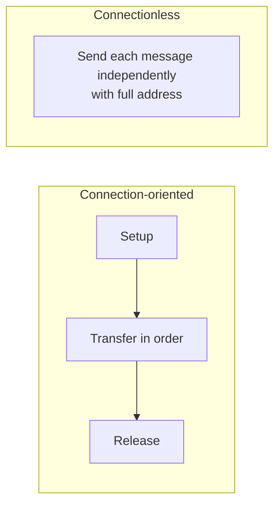

# 01.13 · Connection-Oriented vs Connectionless Services

> [!info] [[01.00 Introduction|Lesson 1]] · Lecture ref Ch1 §1.3 (slides 101–107, 116–117) · Priority 🔴 High (foundation for TCP vs UDP, datagram vs VC, DLL services)
> Supports: [[01.14 Service Primitives]] (3/6 papers), [[01.16 TCP-IP Reference Model]] (TCP vs UDP), [[05.02 Datagram and Virtual-Circuit Networks]]

## 1. Two kinds of service a layer can offer

### Connection-oriented service: like the **telephone system**
*"The system **establishes a connection, uses it, and closes it**. Acts like a **tube**. Data comes out the other end **in the same order** as it goes in."*

Three phases: **Connection setup → Data transfer → Connection termination**.

When a connection is set up, *"the sender, receiver, and subnet conduct a **negotiation** about parameters to be used, such as maximum message size, quality of service required etc. Typically, one side makes a proposal and the other side can accept it, reject it, or make a counterproposal."*

### Connectionless service: like the **post office**
*"Each message has the **entire address** on it. Each message **may follow a different route**. **Ordering not maintained**."* Only one phase: **data transfer**.

## 2. Reliability and service types (lecture)

- **Reliable** services *"never lose data"*, usually by having the **receiver acknowledge** each message. Acknowledgement adds **overhead and delay**: often worth it, sometimes undesirable.
- **Reliable message sequence:** **message boundaries are preserved**: two 1024-byte messages arrive as two 1024-byte messages, *"never as one 2048-byte message."*
- **Reliable byte stream:** messages are broken up or combined; no boundaries (e.g. downloading a file).

| Service | Type | Description (lecture) | Example (Tanenbaum table on slide 107) |
|---|---|---|---|
| Reliable message stream | Connection-oriented | Boundaries kept | Sequence of pages |
| Reliable byte stream | Connection-oriented | Boundaries not kept | Movie download |
| Unreliable connection | Connection-oriented | No ACKs | Voice over IP |
| **Datagram service** | Connectionless | *"Like junk mail… not worth the cost to determine if it actually arrived"*; high probability of arrival but **100% not required; no acknowledgement** | Electronic junk mail |
| **Acknowledged datagram** | Connectionless | As above but **improved reliability via acknowledgement** | Text messaging |
| **Request–reply** | Connectionless | *"Acknowledgment is in the form of a reply"* | Database query |

The lecture notes: *"Not having to establish a connection to send one short message is desired, but reliability is essential"*: this is why acknowledged datagram and request–reply exist.

## 3. Comparison table

| Feature | Connection-oriented | Connectionless |
|---|---|---|
| Analogy | Telephone call | Post office / letters |
| Setup before data | **Yes** (setup → transfer → release) | **No** |
| Addressing | Full address only at setup; then connection ID | **Full address on every message** |
| Route | Same path for all data (in VC networks) | Each message routed **independently** |
| Order | **Preserved** | **Not guaranteed** |
| Reliability | Usually reliable (ACKs, retransmission) | Usually unreliable (best effort) |
| Overhead / delay | Setup delay + ACK overhead | Low overhead, no setup delay |
| Examples | **TCP**, telephone network, virtual circuits, **MPLS**, acknowledged connection-oriented DLL service | **UDP**, **IP**, Ethernet (unacknowledged connectionless), postal-style datagrams |

## 4. Services vs protocols (lecture slides 116–117)

| Service | Protocol |
|---|---|
| A set of **primitives (operations)** a layer provides to the **layer above it** | A set of **rules governing the format and meaning** of packets/messages exchanged by **peer entities** within a layer |
| Relates to the **interface between two layers** (lower = service provider, upper = service user) | Relates to the **packets sent between peers on different machines** |
| Says **what** a layer does | Says **how** the peers do it (can be changed freely as long as the service stays the same) |

## 5. The same idea appears at several layers

| Layer | Connection-oriented | Connectionless |
|---|---|---|
| Data link | Acknowledged connection-oriented service | Unacknowledged / acknowledged connectionless ([[03.01 Functions and Services of the Data Link Layer]]) |
| Network | **Virtual-circuit** network (MPLS) | **Datagram** network (IP) ([[05.02 Datagram and Virtual-Circuit Networks]]) |
| Transport | **TCP** | **UDP** ([[06.01 TCP vs UDP]]) |

## Related
[[01.14 Service Primitives]] · [[01.16 TCP-IP Reference Model]] · [[01.17 OSI vs TCP-IP and the Hybrid Model]] (which modes each model supports)
