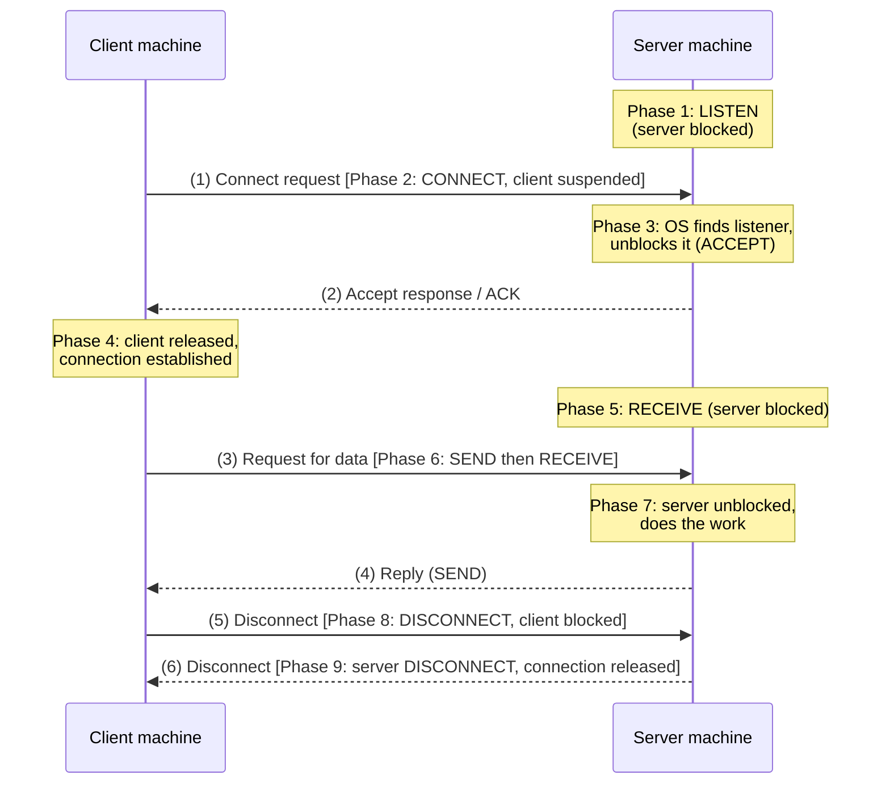

# 01.14 · Service Primitives: Client–Server Interaction Step by Step

> [!info] [[01.00 Introduction|Lesson 1]] · Lecture ref Ch1 §1.3 (slides 108–115) · Priority 🔴 High (3/6 papers, **identical wording**, incl. 2023/24)
> **Asked as:** "Describe, step-by-step, the interactions between two computers using connection oriented services in a Client-Server setting" (2019/20 Q2d, 2023/24 Q2d) · "Client-Server system is a popular network model. Describe, step-by-step, the interactions between a client and a server that uses connection oriented service" (2021/22 Q2d)

## 1. What is a service primitive?
*"A service is formally specified by a set of **primitives (operations)** available to a user process to access the service."* Primitives *"tell the service to perform some action or report on an action taken by a peer entity."* If the protocol stack is in the operating system, primitives are **system calls** that *"cause a trap to kernel mode"*, and the OS then sends the necessary packets.

## 2. The primitives for a simple connection-oriented service

| Primitive | Meaning |
|---|---|
| **LISTEN** | Block waiting for an incoming connection |
| **CONNECT** | Establish a connection with a waiting peer |
| **ACCEPT** | Accept an incoming connection from a peer |
| **RECEIVE** | Block waiting for an incoming message |
| **SEND** | Send a message to the peer |
| **DISCONNECT** | Terminate a connection |

*(Slide 108 says "five service primitives" but the Tanenbaum figure shown lists these six; ACCEPT is the server-side partner of CONNECT. In the phase description below, the OS unblocks the listener and sends the acknowledgement, which is what ACCEPT does.)*

## 3. The interaction (the exam answer)

**Phase 1:** The server executes **LISTEN** to show it is prepared to accept incoming connections. The server process is then **blocked** until a connection request appears.

**Phase 2:** The client executes **CONNECT** to establish a connection with the server; a **connection request packet (1)** is sent. The client is **suspended** until there is a response.

**Phase 3:** When the packet arrives at the server, the **operating system** processes it. Seeing a connection request, it **checks whether there is a listener**. If so, it does two things: **unblocks the listener** and **sends back an acknowledgement (2)**.

**Phase 4:** The arrival of this acknowledgement **releases the client**. Now both are running and **a connection is established**.

**Phase 5:** The server executes **RECEIVE** to prepare to accept the first request. RECEIVE **blocks** the server.

**Phase 6:** The client executes **SEND** to transmit its **request (3)**, then **RECEIVE** to wait for the reply.

**Phase 7:** The request packet **unblocks the server**, which processes the request and uses **SEND** to return the **answer (4)**. If the client has more requests, it can make them now.

**Phase 8:** When finished, the client uses **DISCONNECT**. This is usually **blocking**: the client is suspended and a packet **(5)** tells the server the connection is no longer needed.

**Phase 9:** The server issues its own **DISCONNECT (6)**, acknowledging the client and releasing the connection. When packet (6) reaches the client, the client is released and **the connection is broken**.

## 4. Memory aid
**L-C-A / R-S-R-S / D-D** → *Listen, Connect, Accept · Receive, Send-request, Receive, Send-reply · Disconnect, Disconnect* → **6 packets**: connect, accept, request, reply, disconnect, disconnect.

## 5. Practical networking example
This is exactly how a **TCP socket** program works: the server calls `listen()` and `accept()`, the client calls `connect()`, then both use `send()`/`recv()`, and finally `close()`. *(Additional explanation, beyond the slides; see [[06.02 TCP Connection Management]] for how TCP implements setup with a three-way handshake.)*

## 6. Exam relevance
- 🔴 Repeats word for word in alternate years (2019/20, 2021/22, 2023/24). **Draw the sequence diagram with packets (1)–(6) and write the nine phases.**

## Related
[[01.13 Connection-Oriented and Connectionless Services]] · [[01.04 Client-Server and Peer-to-Peer Models]] · [[06.02 TCP Connection Management]] · [[PP 01.5 - Protocols, Layering and Services]]
