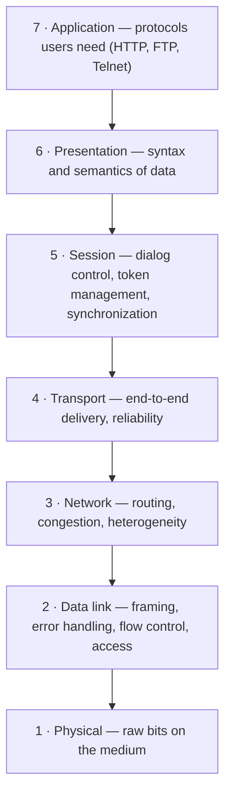

# 01.15 · The ISO OSI Reference Model

> [!info] [[01.00 Introduction|Lesson 1]] · Lecture ref Ch1 §1.4 (slides 119–133) · Priority 🔴 High
> **Asked as:** OSI vs TCP/IP (2019/20, 2022/23, 2023/24 Q3) · "Which (OSI) layer is used… to route packets / convert packets to frame / detect and correct errors / run services like HTTP, FTP, Telnet" (2023/24 Q3d) · DLL functions "of the OSI reference model" (Q5/Q6 every year)

## 1. What is it?
**ISO** = International Standards Organization. **OSI** = **Open Systems Interconnection**: it deals with connecting **open systems**, i.e. *"systems that are open for communication with other systems."*

*"The protocols associated with the OSI model are rarely used, [but] the model itself is actually quite general and still valid, and the features discussed at each layer are still very important."* (TCP/IP is the opposite: the model is weak but the protocols are used everywhere.)

## 2. Principles used to design the layers
1. A layer for each different **level of abstraction**.
2. Each layer performs a **well-defined function**.
3. Each layer's function chosen with an eye to **internationally standardised protocols**.
4. Layer boundaries chosen to **minimise information flow across interfaces**.
5. The **right number of layers**: not too many functions together, not too many layers.

## 3. The seven layers (top to bottom)

### 1. Physical layer
*"Transmits **raw bits** across a medium. Concerns are voltage, timing, duplexing, connectors."* Make sure a 1 sent arrives as a 1, not a 0. Typical questions: how many **volts** for 1 and 0, how many **nanoseconds** a bit lasts, whether transmission can go **both directions at once**, how the connection is set up and torn down. Design issues: **mechanical, electrical and timing interfaces** and the medium. → [[02.00 Physical Layer]]

### 2. Data link layer
- **Framing**: breaks messages into **frames** and reassembles them.
- **Error handling**: solves **damaged, lost and duplicate frames**.
- **Flow control**: keeps a fast transmitter from flooding a slow receiver.
- **Gaining access**: if many hosts share the medium, how is access arbitrated (→ MAC sublayer).
- *"Transforms a raw transmission facility into a line that appears **free of undetected transmission errors** to the network layer."* → [[03.00 Data Link Layer]], [[04.00 MAC Sublayer]]

### 3. Network layer
*"Controls the operation of the **subnet**."*
1. **Routing**: what path packets follow from source to destination (static table, at connection setup, or per packet).
2. **Congestion**: controls the number of packets in the subnet.
3. **Heterogeneity**: interfacing so one type of network can talk to another (different addressing, packet size limits, protocols). → [[05.00 Network Layer]]

### 4. Transport layer
1. **Reliability**: ensures packets arrive; **reassembles out-of-order** messages.
2. **Hides the network** from higher layers.
3. **Service decisions**: error-free point-to-point, datagram, etc.
4. **Mapping**: which messages belong to which connections.
5. **Naming**: "send to node xyzzy" translated to an internal address and route.
6. **Flow control**.
- **Main responsibility:** *"accept data from above, split it up into smaller units if need be, pass these to the network layer, and ensure that the pieces all arrive correctly at the other end."*
- *"A **true end-to-end** layer"*: the source program converses with the destination program. Lower layers talk only to **immediate neighbours**. → [[06.00 Transport Layer]]

### 5. Session layer
- **Dialog control**: keeping track of whose turn it is to transmit.
- **Token management**: preventing two parties attempting the same critical operation at the same time.
- **Synchronisation**: **checkpointing** long transmissions so they can continue after a crash.

### 6. Presentation layer
**Syntax and semantics** of the information transmitted; understands the **nature of the data** (e.g. character encoding, data formats; encryption/compression are commonly placed here).

### 7. Application layer
*"A variety of protocols that are commonly needed by users"*: **FTP, HTTP, Telnet**, etc. → [[07.00 Application Layer]]

## 4. Summary table with data units

| # | Layer | One-line job (lecture summary) | Example protocols / devices | PDU |
|---|---|---|---|---|
| 7 | Application | Application-specific protocols | HTTP, FTP, Telnet, SMTP, DNS | Data / message |
| 6 | Presentation | Syntax and semantics of information | Encoding, encryption, compression | Data |
| 5 | Session | Controls the dialogue between applications (may not be needed by most apps) | Checkpointing, token management | Data |
| 4 | Transport | End-to-end delivery between computers | TCP, UDP | Segment |
| 3 | Network | Source-to-destination routing across multiple machines | IP, routers | Packet |
| 2 | Data link | Line appears free of undetected errors | Ethernet, 802.11, switches, bridges | Frame |
| 1 | Physical | Transmission of bits | Cables, hubs, repeaters, NRZ | Bits |

*(The PDU column and devices are additional explanation; "segment" for transport and "frame" for DLL are lecture terms.)*

## 5. 2023/24 Q3(d) quick answers
| Task | OSI layer |
|---|---|
| (i) Route packets | **Network layer (3)** |
| (ii) Convert packets to frames | **Data link layer (2)** (framing) |
| (iii) Detect and correct errors | **Data link layer (2)** (hop by hop; the transport layer also provides end-to-end reliability) |
| (iv) Run services like HTTP, FTP, Telnet | **Application layer (7)** |

## 6. Memory aid
Top→bottom: **"All People Seem To Need Data Processing"**. Bottom→top: **"Please Do Not Throw Sausage Pizza Away"**.

## Related
[[01.16 TCP-IP Reference Model]] · [[01.17 OSI vs TCP-IP and the Hybrid Model]] · [[01.11 Protocol Hierarchies and Encapsulation]] · [[PP 01.6 - Reference Models, TCP and UDP]]
