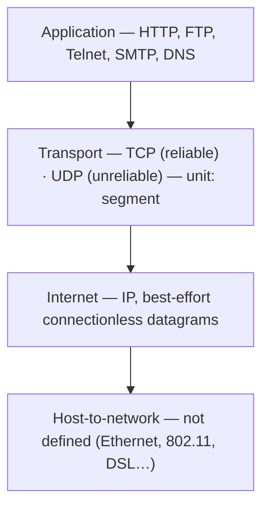

# 01.16 · The TCP/IP Reference Model (and TCP vs UDP)

> [!info] [[01.00 Introduction|Lesson 1]] · Lecture ref Ch1 §1.4 (slides 134–145) · Priority 🔴 High
> **Asked as:** "Compare and Contrast TCP and UDP protocols" (2019/20 Q3c, 2023/24 Q3c) · "State the similarities and differences of TCP and UDP protocols" (2022/23 Q3b) · OSI vs TCP/IP (3 papers)

## 1. History and goals
- Used first in **ARPANET** (Advanced Research Projects Agency Network), a research network sponsored by the **U.S. Department of Defense (DoD)**, connecting universities and government sites over leased telephone lines.
- When **satellite and radio networks** were added, the old protocols had trouble interworking, so **a new reference architecture was needed**.
- Design goals:
  - Connect **multiple networks in a seamless way**.
  - **Survive loss of subnet hardware**: conversations should not break as long as the source and destination machines work, even if machines or lines in between fail.
- Goals (lecture list): **seamless interoperability · wide-ranging applications · fault tolerance (to some extent).**

## 2. The four layers



### Application layer
*"The residence of network applications and their application control logic"*: **HTTP** (Web), **FTP** (file transfer), **Telnet** (terminal), **SMTP** (mail), **DNS** (Domain Name System). TCP/IP has **no session or presentation layers**: *"they are of little use to most applications."*

### Transport layer
*"Concerned with **end-to-end** data transfer between end systems (hosts)."* Transmission unit = **segment**. Two services: **TCP** and **UDP**. Peer entities on source and destination carry on a conversation, as in the OSI transport layer.

### Internet layer
- Provides a **packet-switched connectionless** service. **IP** does delivery (and the lecture also says congestion control).
- End systems **inject datagrams**; a path is chosen **for each packet** (routing).
- **"Best effort"**: datagrams **might be lost** or **arrive out of order**, similar to the **postal system**; higher layers reorder if needed.
- Defines an official packet format and protocol called **IP**. Similar to the **OSI network layer**. → [[05.07 IPv4 Header]]

### Host-to-network layer
*"Somehow, host has to connect to the network and be able to send IP datagrams."* **Not defined** by the model; various mechanisms are used.

## 3. TCP and UDP (lecture definitions)

**TCP (Transmission Control Protocol)** *(the slide writes "Transport Control Protocol")*
- *"A **reliable connection-oriented** protocol that delivers a **byte stream** from one node to another. **Guarantees delivery** and provides **flow control**."*
- Lets a byte stream from one machine be delivered **without error** on any other machine on the Internet.
- **Fragments** the incoming byte stream into discrete messages and passes each to the internet layer; the receiving TCP **reassembles** them into the output stream.

**UDP (User Datagram Protocol)** *(the slide has a typo "DUP")*
- *"An **unreliable connection-less** protocol for applications that provide their own connection establishment/reliability."*
- For applications that do **not want TCP's sequencing or flow control**.
- Widely used for **one-shot client–server request–reply queries** and applications where **prompt delivery is more important than accurate delivery**, such as **speech or video**.

### TCP vs UDP (exam table)

| Feature | TCP | UDP |
|---|---|---|
| Connection | **Connection-oriented** (setup before data) | **Connectionless** |
| Reliability | **Reliable**: guarantees delivery (ACKs, retransmission) | **Unreliable**: no guarantee |
| Ordering | Delivers **in order** (sequencing, reassembly) | No ordering |
| Flow control | **Yes** | No |
| Data unit | **Byte stream** (no message boundaries) | Individual **datagrams/messages** |
| Overhead / speed | Higher overhead, slower (setup + ACKs) | Low overhead, **fast** |
| Typical uses | Web (HTTP), e-mail (SMTP), file transfer (FTP), remote login | **DNS queries**, VoIP, video streaming, online games |

**Similarities:** both are **transport-layer** protocols of TCP/IP; both run **on top of IP**; both provide **end-to-end (process-to-process)** delivery between hosts; both use **port numbers** to identify applications and carry a **checksum** *(ports and checksum are additional explanation from the textbook)*.

> [!note] More detail
> TCP's three-way handshake, flow control and congestion control are not in the CMIS 3114 Chapter 1 slides. They are explained, clearly marked as textbook material, in [[06.01 TCP vs UDP]], [[06.02 TCP Connection Management]] and [[06.03 TCP Flow Control and Congestion Control]].

## 4. Protocols and networks in the initial TCP/IP model (slide 145)

```text
Application   TELNET  FTP  SMTP  DNS
Transport          TCP        UDP
Internet                IP
Link          ARPANET  SATNET  Packet radio  LAN
```

## Related
[[01.15 OSI Reference Model]] · [[01.17 OSI vs TCP-IP and the Hybrid Model]] · [[01.13 Connection-Oriented and Connectionless Services]] · [[06.01 TCP vs UDP]] · [[PP 01.6 - Reference Models, TCP and UDP]]
