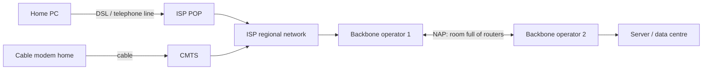

# 01.18 · Example Networks: ARPANET, NSFNET, the Internet, Ethernet, WLANs

> [!info] [[01.00 Introduction|Lesson 1]] · Lecture ref Ch1 §1.5 (slides 158–180) · Priority 🟢 Low (not asked directly) · Useful for **"Telephone network vs Internet"** ([[02.04 Public Switched Telephone Network]])

## 1. ARPANET (Advanced Research Projects Agency NETwork)
- Background figure: (a) the **centralised structure of the telephone system** vs (b) **Baran's proposed distributed switching system**, which survives the loss of nodes.
- **1968**: intended as a **reliable network with multiple routing**; used a TCP/IP precursor that was built into early UNIX.
- The subnet: minicomputers called **IMPs (Interface Message Processors)** connected by **56-kbps** lines. Each IMP connected to **at least two other IMPs** for reliability.
- A **datagram subnet**: if some lines/IMPs were destroyed, messages could be **automatically rerouted**.
- Growth: Dec 1969 (4 sites) → Jul 1970 → Mar 1971 → Apr 1972 → Sep 1972.

## 2. NSFNET
- Late 1970s: many others wanted access, but ARPANET was limited to military contractors, so the **NSF set up another network**.
- Started at **448 kbps**, upgraded to **1.5 Mbps** in the 1980s. 1990: **ANS** (MERIT, MCI, IBM) took over at **45 Mbps**. 1995: ANSNET sold to AOL.

## 3. The Internet
- *"Network of networks"*, *"collection of networks interconnected by routers"*, *"a communication medium used by millions."*
- **All nodes run TCP/IP**, so every node has an **IP address**.
- Services: e-mail, news, remote login, file transfer, the Web. **Traditional applications (1970–1990): e-mail, news, remote login, file transfer.**
- *"The Web is not a computer network but a distributed application that runs on top of the Internet."*

### Architecture of the Internet (how your packet reaches a server)

1. The user's traffic reaches the ISP's **POP (Point of Presence)**, where it is *"removed from the telephone system and injected into the ISP's regional network. From this point on, the system is fully digital and packet switched."* (A POP is *"a location where a long-distance carrier could terminate services and provide connections into a local telephone network."*)
2. Cable customers connect through a **CMTS (Cable Modem Termination System)**, which carries TV channels, high-speed data and voice.
3. If the destination host is served directly by the ISP, the packet is delivered; otherwise it is handed to the ISP's **backbone operator**.
4. If the destination is served by that backbone, the packet goes to the closest router and is handed off.
5. To hop **between backbones**, all major backbones connect at **NAPs (Network Access Points)**: *"a room full of routers, at least one per backbone."*

### History and growth
- Late 1970s: proliferation of LANs; WANs were rarer and expensive. Need for a single network linking LANs, distributed companies and researchers.
- ARPANET features: **decentralised, non-regulated, no central authority, no structure, network of networks**; TCP/IP as **public-domain software**, an **open system**.
- 1981: ~100 computers; 20 years later ~60 million. In the early 1990s the **Web** became the Internet's **killer application**.
- Future concerns (lecture): end of growth? physical resource limits, limitations of TCP/IP.

## 4. Ethernet (original architecture)
Organisations with many computers needed **LANs**. In the original Ethernet, *"before transmitting, a computer first listened to the cable to see if someone else was already transmitting. If so, the computer held back until the current transmission finished,"* giving much higher efficiency. This is **carrier sensing** → [[04.03 CSMA and CSMA-CD]].

## 5. Wireless LANs (802.11 / WiFi)
Two modes: **with a base station** and **ad hoc** (no base station); challenges of the design; **multicell** networks with base stations linked by Ethernet. → [[01.05 Mobile Computing and Wireless Networks]], [[04.06 IEEE 802.11 WiFi]]

## Related
[[01.16 TCP-IP Reference Model]] · [[02.04 Public Switched Telephone Network]] · [[02.09 Switching - Circuit, Message and Packet]]
