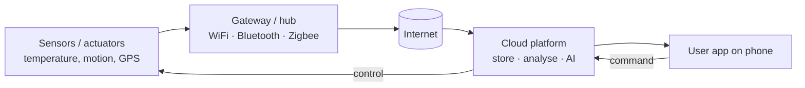

# 01.20 · IoT, Smart Homes, Smart Cars (Beyond the Slides)

> [!warning] Not in the CMIS 3114 lecture slides
> The Internet of Things is examined in **5 of 6 papers** as a Q1(c) short note, but **no slide covers it**. Everything here is **general networking knowledge**, connected to lecture topics where possible (BAN/PAN, wireless networks, mobile users). Learn it because the marks are reliable.
> **Asked as:** short note "Internet of Things" (2019/20 Q1c(ii), 2021/22 Q1c(ii), 2023/24 Q1c(ii)) · "Smart Home" (2022/23 Q1c(ii)) · "Use of IoT techniques for Smart Cars" (2020/21 Q8b(iii))

## 1. What is IoT?
**Simple English:** everyday objects (lights, fridges, cars, watches, farm sensors) get a small computer, sensors and a network connection, so they can **send data and be controlled over the Internet** without a person typing on a computer.

**Definition:** the **Internet of Things** is a network of physical objects ("things") embedded with **sensors, actuators, processors and communication hardware**, which **collect and exchange data** over the Internet and act on it, often automatically.

## 2. How it works (typical architecture)

1. **Perception layer:** sensors measure (temperature, motion) and actuators act (switch a light).
2. **Network layer:** devices connect through **short-range wireless** (Bluetooth = PAN/802.15, WiFi = 802.11, Zigbee) to a **gateway**, then over the Internet (or directly over 4G/5G).
3. **Processing layer:** **cloud** servers store and analyse data (sometimes with AI).
4. **Application layer:** the user monitors and controls through a **mobile app**.

Links to the course: **BAN/PAN** for wearables ([[01.09 Network Classification by Scale]]), **wireless LANs** ([[04.06 IEEE 802.11 WiFi]]), **mobile networks** ([[02.10 Mobile Telephone System and Handoff]]), **client–server** cloud model ([[01.04 Client-Server and Peer-to-Peer Models]]), **IPv4 address shortage** ([[05.08 IP Addresses and Classful Addressing]]).

## 3. Benefits and issues (the short-note format the papers ask for)

| Benefits | Issues |
|---|---|
| **Automation and convenience** (lights, irrigation) | **Security**: weak passwords, unpatched devices can be hacked or used in botnets |
| **Remote monitoring and control** from a phone | **Privacy**: continuous data collection about people's behaviour |
| **Efficiency**: energy saving, less waste | **Interoperability**: many vendors and protocols, no single standard |
| **Better decisions** from real-time data | **Network load / IP addresses**: billions of devices need addresses (IPv6) and bandwidth |
| Health, agriculture, transport, industry applications | **Reliability**: depends on Internet and power; battery life of sensors; cost |

## 4. Smart home (2022/23)
Devices: smart lights, thermostats/AC, door locks, CCTV cameras, smart plugs, voice assistants, connected appliances, linked by **home WiFi** and **Bluetooth/Zigbee** to a hub and the cloud.
- *Benefits:* convenience (control from phone/voice), **energy saving** (lights off when empty), **security** (camera alerts, smart locks), elderly care (fall sensors).
- *Issues:* hacked cameras/locks, privacy of recordings, dependence on Internet, cost, compatibility between brands.

## 5. IoT in smart cars (2020/21)
- **Sensors:** GPS, cameras, radar/LiDAR, tyre pressure, engine diagnostics.
- **Connectivity:** **4G/5G** cellular for cloud services; **V2V/V2X** (vehicle-to-vehicle / to-infrastructure) wireless links, which form ad hoc networks between cars; Bluetooth to the driver's phone.
- **Uses:** navigation with live traffic, collision warning and automatic braking, remote diagnostics and over-the-air updates, emergency call after a crash, fleet tracking, self-driving assistance.
- **Issues:** cyber-attacks on vehicle systems (safety risk), privacy of location data, need for low-latency, reliable connections (5G), cost.

## 6. Exam relevance
- 🔴 Very likely to appear again as a short note. Write: **definition → 4-layer architecture or diagram → 3 benefits → 3 issues → one example**.

## Related
[[01.05 Mobile Computing and Wireless Networks]] · [[01.06 Social Issues of Computer Networks]] · [[PP 01.2 - Mobile Computing, IoT and Wireless]]
