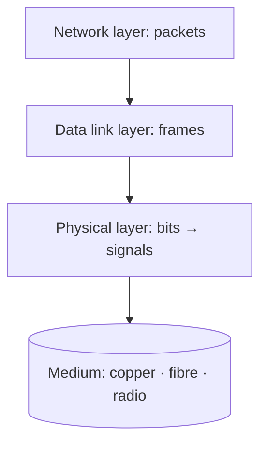

# 02 · The Physical Layer

> [!info] Lesson map
> **Source:** Lecture deck *Chapter 2 – The Physical Layer* · [[00. CMIS 3114 Course Overview|Course Overview]]
> **Exam priority:** 🔴 **High.** About **24%** of all past-paper sub-questions. Q4 of every 8-question paper is Physical Layer; parts of Q2 (Telephone vs Internet), Q3 (Nyquist/Shannon) and Q5/Q6 (multiplexing, switching, GSM) too.
> **Past questions:** [[PP 02.1 - Transmission Media and Satellites|PP 02.1]] · [[PP 02.2 - Modulation and Data Rate Calculations|PP 02.2]] · [[PP 02.3 - Multiplexing and CDMA|PP 02.3]] · [[PP 02.4 - Switching, Telephone and Mobile Networks|PP 02.4]]
> **Quick revision:** [[02.99 Summary - Physical Layer]]

## What this lesson is about
The physical layer moves **raw bits** from one machine to the next. This lesson covers:
1. **The media** that carry signals: wires and fibre (guided), radio/microwave/light (wireless), satellites.
2. **Real carrier systems**: the telephone network (PSTN), mobile phone networks (1G–5G, GSM), cable TV.
3. **How bits become signals**: baseband (NRZ, NRZI) and passband (ASK, FSK, PSK, QAM) modulation.
4. **How many users share a link**: multiplexing (FDM, OFDM, WDM, TDM, CDMA).
5. **The theoretical limit**: Nyquist (noiseless) and Shannon (noisy) maximum data rates.
6. **Switching**: circuit vs message vs packet switching.

> [!note] Slide order vs note order
> The slides go: media → wireless → satellites → PSTN → digital modulation → multiplexing → theory (Nyquist/Shannon) → switching → mobile → cable TV. The notes follow the same order.

## Topic structure

```text
Physical Layer
├── Guided media: magnetic media · twisted pair · coaxial · fibre optics
├── Wireless: EM spectrum · radio · microwave · infrared/mm · lightwave · ISM politics · Loon
├── Satellites: GEO · MEO · LEO (Iridium, Globalstar) · VSAT · satellites vs fibre
├── PSTN: structure · local loop / trunks / switching offices · LATA, LEC, IXC, POP · modems, ADSL, LMDS
├── Digital modulation: baseband (NRZ, NRZI) · passband (ASK, FSK, BPSK, QPSK, QAM-16/64)
├── Multiplexing: FDM · OFDM · WDM · TDM (T1) · CDM/CDMA
├── Theory: Fourier · bandwidth · Nyquist · SNR (dB) · Shannon
├── Switching: circuit · message · packet
├── Mobile: 1G IMTS/AMPS · handoff · 2G D-AMPS, GSM · 2.5G · 3G · 4G · 5G
└── Cable TV: CATV · HFC · Internet over cable
```

## Notes in this lesson

| # | Note | Exam weight (papers out of 6) |
|---|---|---|
| 1 | [[02.01 Guided Transmission Media]] | 🔴 5/6 (construction diagrams) |
| 2 | [[02.02 Wireless Transmission]] | 🟡 (wired vs wireless, long-distance options) |
| 3 | [[02.03 Communication Satellites]] | 🟢 1/6 |
| 4 | [[02.04 Public Switched Telephone Network]] | 🔴 Telephone vs Internet 3/6 incl. 2023/24 |
| 5 | [[02.05 Digital Modulation - Baseband and Passband]] | 🟡 3/6 (+ NRZ/NRZI 2/6) |
| 6 | [[02.06 Multiplexing - FDM, OFDM, WDM and TDM]] | 🔴 5/6 |
| 7 | [[02.07 Code Division Multiple Access (CDMA)]] | 🟢 1/6 |
| 8 | [[02.08 Maximum Data Rate - Nyquist and Shannon]] | 🔴 4/6 (calculation) |
| 9 | [[02.09 Switching - Circuit, Message and Packet]] | 🟡 2/6 (+ used in Telephone vs Internet) |
| 10 | [[02.10 Mobile Telephone System and Handoff]] | 🟡 handoff 2/6 |
| 11 | [[02.11 GSM Architecture]] | 🟡 3/6 |
| 12 | [[02.12 Cable Television and Internet over Cable]] | 🟢 0/6 |
| ★ | [[02.99 Summary - Physical Layer]] | Revision |

## Where the physical layer sits


The physical layer **does not understand frames or packets**: it only turns bits into signals (voltages, light pulses, radio waves) and back. Errors it cannot avoid (noise) are handled by the data link layer ([[03.00 Data Link Layer]]).

## Related
- Old stub note (kept unchanged): [[3114-02 Physical Layer]]
- Previous: [[01.00 Introduction]] · Next: [[03.00 Data Link Layer]]
