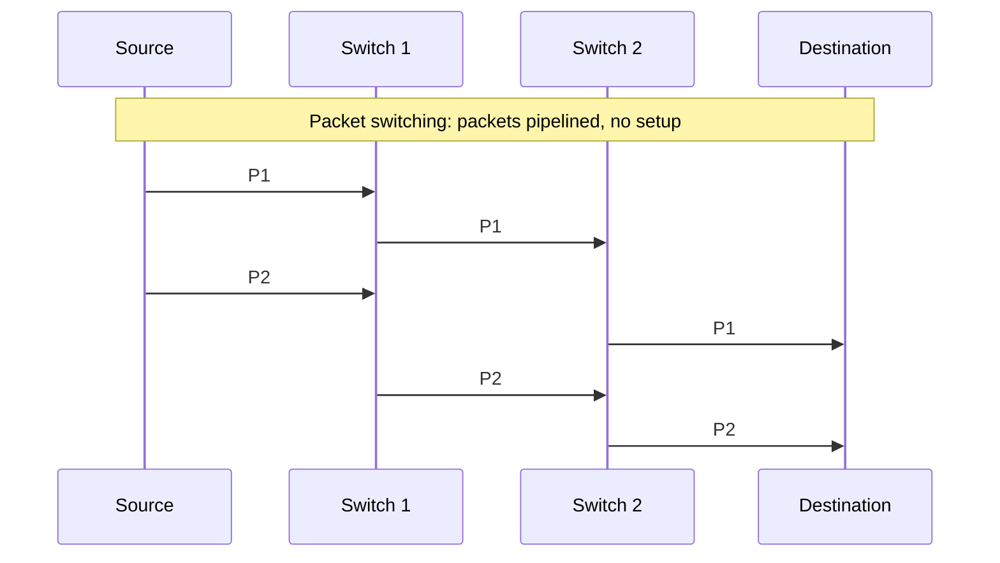

# 02.09 · Switching: Circuit, Message and Packet Switching

> [!info] [[02.00 Physical Layer|Lesson 2]] · Lecture ref Ch2 slides 86–92 · Priority 🟡 Medium (2/6 papers directly; also the core of "Telephone network vs Internet", 3/6)
> **Asked as:** "Explain the similarities and differences between Circuit Switching and Packet Switching" (2019/20 Q5b) · "Differentiate between the circuit switching and packet switching techniques. Provide example usages" (2021/22 Q6b)

## 1. Circuit switching
**Lecture:** *"The switching equipment within the telephone system **seeks out a physical path all the way** from your telephone to the receiver's telephone."* For nearly 100 years the equipment was **Strowger gear** (electromechanical). The lecture also shows a **modern exchange** equipped for voice and broadband data.

**Steps:**
1. **Setup:** the caller dials; switches along the route reserve a dedicated path (circuit). Setup time can be seconds.
2. **Transfer:** all data flows over the **reserved path** at a **fixed rate**, in order, with no queueing.
3. **Release:** the circuit is torn down when the call ends.

## 2. Packet switching
**Lecture:**
- *"Packets are sent **as soon as they are available**. There is **no need to set up a dedicated path** in advance."*
- *"It is up to routers to use **store-and-forward** transmission to send each packet on its way to the destination on its own."*
- Packets **may arrive out of order**.

**Issues (lecture):**
- **No fixed path**: different packets can follow **different paths** depending on network conditions.
- Packets **may arrive out of order**.
- Networks place a **tight upper limit on packet size**, *"to ensure that no user can **monopolize** any transmission line for very long."*

## 3. Message switching
The lecture figure compares (a) circuit, (b) **message** and (c) packet switching. In message switching *(textbook explanation)* **no path is set up**; the **whole message** is sent to the first switch, **stored completely**, then forwarded hop by hop (store-and-forward of the entire message, like old telegrams). Problem: long messages tie up links and need large buffers, so **packet switching** split messages into small, size-limited packets that can be **pipelined** (the next hop starts while the previous hop is still sending later packets), reducing delay.

## 4. Comparison (lecture table, slide 92)

| Item | Circuit switched | Packet switched |
|---|---|---|
| Call setup | **Required** | **Not needed** |
| Dedicated physical path | **Yes** | **No** |
| Each packet follows the same route | Yes | No |
| Packets arrive in order | Yes | No |
| Is a switch crash fatal | **Yes** | No |
| Bandwidth available | **Fixed** | **Dynamic** |
| Time of possible congestion | **At setup time** | **On every packet** |
| Potentially wasted bandwidth | **Yes** | No |
| Store-and-forward transmission | No | **Yes** |
| Charging | **Per minute** | **Per packet** |

*(The slide shows this standard Tanenbaum table as an image.)*

**Similarities:** both move data from source to destination through **intermediate switching nodes**; both use **addressing** to reach the destination; both run over the **same physical media** (copper, fibre, radio) and use **multiplexing** on trunks; both are used in WANs.

**Example usages:**
- Circuit switching: **traditional telephone calls (PSTN)**, ISDN, 1G/2G voice calls (GSM voice), leased lines.
- Packet switching: **the Internet (IP)**, e-mail, web browsing, VoIP, mobile data (GPRS/4G).
- Message switching: telegram networks, early e-mail store-and-forward systems.

## 5. Advantages and disadvantages
| | Advantages | Disadvantages |
|---|---|---|
| Circuit | Guaranteed bandwidth, constant delay, in-order delivery: good for **real-time voice** | Setup delay; bandwidth **wasted when idle**; a switch failure drops the call |
| Packet | **Efficient** sharing (bandwidth only used when sending); robust: reroute around failures; no setup | Variable delay (queueing), possible loss and reordering; congestion on every packet; overhead of headers |

## Related
[[02.04 Public Switched Telephone Network]] · [[01.09 Network Classification by Scale]] (store-and-forward subnet) · [[05.01 Network Layer Design Issues]] · [[05.02 Datagram and Virtual-Circuit Networks]] · [[PP 02.4 - Switching, Telephone and Mobile Networks]]
