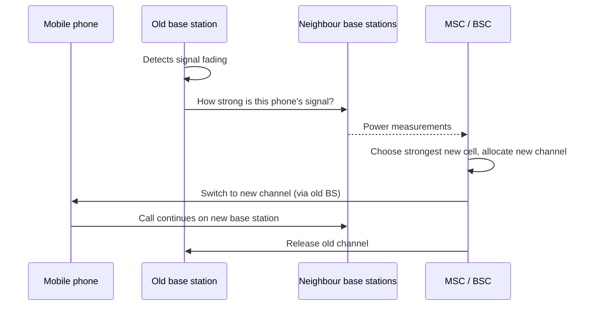

# 02.10 · The Mobile Telephone System (1G–5G) and Handoff

> [!info] [[02.00 Physical Layer|Lesson 2]] · Lecture ref Ch2 slides 93–104, 112–114 · Priority 🟡 Medium (handoff 2/6 papers)
> **Asked as:** "Describe the procedure of 'handoff' operation in Mobile Networks" (2019/20 Q5d, 2021/22 Q6d)

## 1. Generations (lecture overview)

| Gen | Lecture description | Key technology |
|---|---|---|
| **1G** | **Analog voice** | IMTS, AMPS |
| **2G** | **Digital voice** | D-AMPS, **GSM** |
| **2.5G** | Data on 2G | **EDGE** (*"GSM with more bits per symbol"*), **GPRS** (*"packet oriented mobile data service"*) |
| **3G** | **Digital voice and data** | IMT-2000: **WCDMA/UMTS**, **CDMA2000** |
| **4G** | Digital voice and data, **video conference, cloud, LTE** | **LTE**, WiMAX (802.16) |
| **5G** | Digital voice and data **@ 1 Gbps, lower latency than LTE** | (5G NR) |

## 2. 1G: IMTS and AMPS
**IMTS (Improved Mobile Telephone System):** one high-power transmitter on a hill; **one cell of 50 km radius**; two frequencies (send and receive, so **no push-to-talk button**); only **23 channels**, so users often **waited a long time for a dial tone**; adjacent systems had to be **several hundred km apart** to avoid interference.

**AMPS (Advanced Mobile Phone System)** (retired 2008):
- Area divided into **cells**, typically **10–20 km** across.
- **Frequency reuse:** frequencies are **not reused in adjacent cells**, but can be reused in cells further away. **To add more users, use smaller cells** (microcells), so frequencies are reused more often.
- All base stations connect to an **MSC (Mobile Switching Center)**, also called **MTSO (Mobile Telephone Switching Office)**, which connects to the telephone system end office. MSCs talk to base stations, each other and the PSTN **using a packet-switching network**.
- **832 channels** in four categories: **Control** (base→mobile, manage system) · **Paging** (base→mobile, alert users to calls) · **Access** (bidirectional, call setup and channel assignment) · **Data** (bidirectional, voice/fax/data).
- First handheld mobile call: **Dr. Martin Cooper of Motorola, 1973**.

```text
    / \ / \ / \        Cells in a hexagon pattern.
   | A | B | C |       Same letter = same frequency group;
    \ / \ / \ /        never reused in an adjacent cell.
     | C | A | B |
      \ / \ / \ /
```

## 3. Handoff (handover): step by step

**Lecture:** *"Base station notices the telephone's signal **fading away** and asks all the **surrounding base stations how much power they are getting** from it. Takes about **300 msec**."*

**Full procedure (lecture + textbook detail):**
1. A mobile user in a call moves towards the **edge of the current cell**.
2. The **current base station** monitors the signal and notices it **fading**.
3. It **asks all surrounding base stations** how much power they receive from the phone.
4. The **MSC/BSC** chooses the base station with the **strongest signal** as the new cell.
5. The MSC/BSC **assigns a new channel** in the new cell (the old frequency cannot be used, because adjacent cells use different frequencies).
6. The mobile is **told to switch** to the new channel/base station; the call continues and the old channel is released.
7. The whole process takes **about 300 ms**, normally unnoticed by the user.



*(Additional explanation: in **hard handoff** the old link is released before the new one is used; in **soft handoff** (CDMA/3G) the phone is briefly connected to both. In GSM, handoff is handled by the **BSC**; see [[02.11 GSM Architecture]].)*

## 4. From analog to digital (2G)
Benefits of digital (lecture):
- **Capacity gains**: voice is **digitised and compressed**.
- **Security**: voice and control signals can be **encrypted**, deterring **fraud and eavesdropping**.
- **New services** such as **text messaging (SMS)**.

**D-AMPS (Digital AMPS):** digital version of AMPS that **coexists** with AMPS and uses **TDM** to put multiple calls on the same frequency channel: a D-AMPS channel with **three users**, or **six users** with lower-rate voice coding.

## 5. 3G and 4G
**3G (IMT-2000) basic services:** high-quality voice · messaging (replacing e-mail, fax, SMS, chat) · multimedia (music, video, TV) · Internet access. Two contenders: **WCDMA** (Ericsson, EU, called **UMTS**) and **CDMA2000**. Both are based on **CDMA** ([[02.07 Code Division Multiple Access (CDMA)]]).

**4G (LTE, Long Term Evolution):** high bandwidth; **ubiquity** (connectivity everywhere); **seamless integration with other IP networks** including WiFi access points; adaptive resource and spectrum management; high QoS for multimedia. **802.16 WiMAX** also reaches 4G-level performance ([[04.07 Broadband Wireless - WiMAX, 4G and 5G]]).

## Related
[[02.11 GSM Architecture]] · [[01.05 Mobile Computing and Wireless Networks]] · [[02.06 Multiplexing - FDM, OFDM, WDM and TDM]] · [[PP 02.4 - Switching, Telephone and Mobile Networks]]
