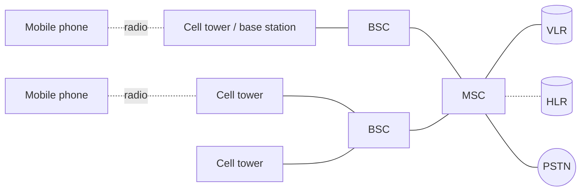

# 02.11 · GSM Architecture

> [!info] [[02.00 Physical Layer|Lesson 2]] · Lecture ref Ch2 slides 105–111 · Priority 🟡 Medium (3/6 papers)
> **Asked as:** "Following diagram represents the architecture of a simple GSM network which contain the BSC, MSC, HLR, VLR and PSTN. Identify each of these components and describe how they support a land line telephone to call a mobile phone" (2019/20 Q5c) · "…Identify the components… Describe their functionality in the network" (2021/22 Q6c) · short note "GSM mobile architecture" (2020/21 Q8b(ii))

## 1. What is GSM?
**Groupe Spécial Mobile** (French), renamed **Global System for Mobile communications**. A **2G digital** system, very successful worldwide. Like AMPS it is based on **cells, frequency reuse across cells, and mobility with handoffs**.

### SIM card
The mobile is split into the **handset** and a removable chip, the **SIM (Subscriber Identity Module)**, holding subscriber and account information. The SIM **activates the handset** and holds **secret codes** that let the mobile and network **identify each other** and **encrypt conversations**.

## 2. Architecture (the exam diagram)

| Component | Function (lecture) |
|---|---|
| **Cell base station** (tower) | Radio link to the mobiles in its cell |
| **BSC (Base Station Controller)** | *"Controls the **radio resources of cells** and **handles handoff**."* Several base stations connect to one BSC |
| **MSC (Mobile Switching Center)** | *"**Routes calls** and **connects to the PSTN**."* Switching centre of the mobile network |
| **VLR (Visitor Location Register)** | Database **at the MSC** of **nearby mobiles currently associated with the cells it manages**, so the MSC knows **where mobiles can be found** |
| **HLR (Home Location Register)** | Database giving the **last known location of each mobile**; **used to route incoming calls** to the right place |
| **PSTN (Public Switched Telephone Network)** | The fixed telephone network the MSC connects to ([[02.04 Public Switched Telephone Network]]) |

*"Both databases must be kept up to date as mobiles move from cell to cell."*

## 3. Landline → mobile call: step by step (2019/20 Q5c)
1. A **landline** user dials the mobile number. The **PSTN** routes the call to a **gateway MSC** of the mobile operator.
2. The MSC queries the **HLR** for the mobile's **last known location** (which MSC/VLR area it is in).
3. The HLR points to the **MSC/VLR** currently serving that mobile; the call is routed there.
4. That MSC checks its **VLR** to find the **location area / cells** where the mobile is registered.
5. The MSC asks the **BSC(s)**, which page the mobile through their **base stations** (paging channel).
6. The mobile answers; the **BSC allocates a radio channel (a TDM slot)** and the call is connected PSTN ↔ MSC ↔ BSC ↔ base station ↔ mobile.
7. If the user moves during the call, the **BSC handles handoff** ([[02.10 Mobile Telephone System and Handoff]]), and the VLR/HLR are updated when the mobile moves to a new area.

## 4. Radio channels and framing
- GSM uses **124 frequency channels**, each using an **eight-slot TDM** system (so up to 8 users per frequency).
- The lecture shows a portion of the **GSM framing structure** (TDM frames grouped into multiframes; each slot carries a burst of bits).

## 5. Exam relevance
- 🟡 Draw the diagram, define **each of the five components** in one or two sentences, then describe the **call flow** (HLR → VLR → BSC paging → channel allocation).

## Related
[[02.10 Mobile Telephone System and Handoff]] · [[02.06 Multiplexing - FDM, OFDM, WDM and TDM]] · [[PP 02.4 - Switching, Telephone and Mobile Networks]]
