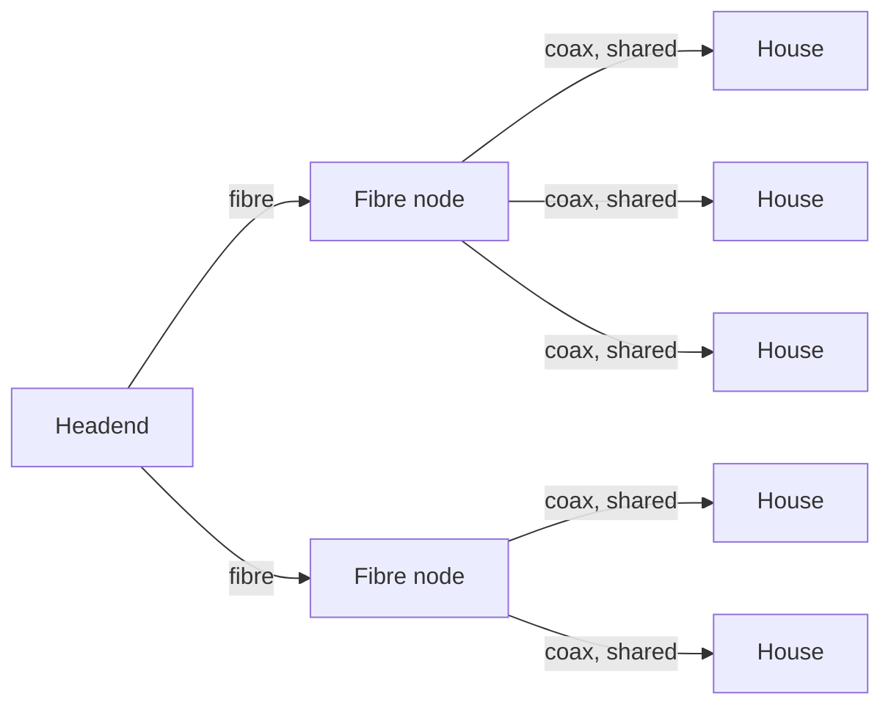

# 02.12 · Cable Television and Internet over Cable

> [!info] [[02.00 Physical Layer|Lesson 2]] · Lecture ref Ch2 slides 115–120 · Priority 🟢 Low (not asked; linked to cable channel calculations, MAN, CMTS)

## 1. Community Antenna Television (CATV)
- An early cable TV system: a big antenna on a hill picks up TV signals, a **headend** amplifies them, and **coaxial cable with amplifiers** carries them to houses in a **small community**.
- As subscribers grew, operators **interconnected systems**, and cables between cities were replaced by **high-bandwidth fibre**.

## 2. HFC: Hybrid Fiber Coax
- *"A system with **fiber for the long-haul runs** and **coaxial cable to the houses** is called an HFC (Hybrid Fiber Coax) system."*
- **Fiber nodes:** *"the electro-optical converters that interface between the optical and electrical parts of the system."*

## 3. Internet over cable vs ADSL
- *"All the programs are broadcast on the cable and it does not matter whether there are 10 viewers or 10,000 viewers."*
- But for Internet use, the cable is a **shared medium**: *"if one user decides to download a very large file, that bandwidth is potentially being taken away from other users."*
- The **telephone system does not have this property**: *"downloading a large file over an ADSL line does not reduce your neighbor's bandwidth"* (each home has its own local loop).
- Each local cable segment connects to a fibre node; *"as long as there are not too many subscribers on each cable segment, the amount of traffic is manageable."*

| Cable Internet | ADSL |
|---|---|
| Coax shared by all houses on a segment | Dedicated twisted-pair local loop per home |
| Speed drops when neighbours are busy | Speed depends on distance to end office |
| Higher total bandwidth | Lower bandwidth |
| Connects via **CMTS** at the headend ([[01.18 Example Networks]]) | Connects via DSLAM at the end office |

A city cable TV network is the lecture's example of a **MAN** ([[01.09 Network Classification by Scale]]). The 2018/19 Q4(a) data-rate question uses a **4 MHz cable TV channel** ([[02.08 Maximum Data Rate - Nyquist and Shannon]]).

## Related
[[02.01 Guided Transmission Media]] (coax) · [[02.04 Public Switched Telephone Network]] (ADSL)
