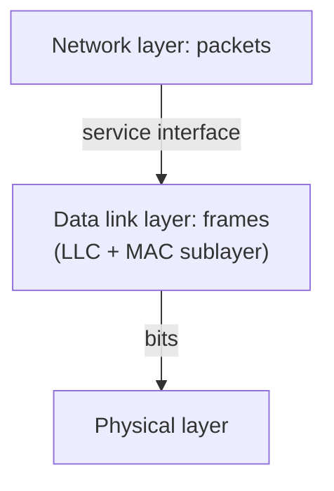

# 03 · The Data Link Layer

> [!info] Lesson map
> **Source:** Lecture decks *Chapter 3 – Data Link Layer L1* (23 slides) and *L2* (29 slides) · [[00. CMIS 3114 Course Overview|Course Overview]]
> **Exam priority:** 🔴 **High.** Q5 of every 8-question paper is a DLL question (functions/services + framing + error codes), and Go-Back-N / sliding window appear in Q6/Q7. About **15%** of sub-questions, almost all **calculations or procedures**.
> **Past questions:** [[PP 03.1 - DLL Functions and Framing|PP 03.1]] · [[PP 03.2 - Error Detection and Correction|PP 03.2]] · [[PP 03.3 - Sliding Window and Go-Back-N|PP 03.3]]
> **Quick revision:** [[03.99 Summary - Data Link Layer]]

## What this lesson is about
The physical layer delivers a raw, error-prone **bit stream**. The data link layer turns it into a reliable link **between two directly connected machines** by:
1. offering a **service interface** to the network layer,
2. **framing** the bits,
3. **dealing with transmission errors** (detection and correction codes, ACKs, timers, sequence numbers),
4. **regulating data flow** (flow control: slow receivers not swamped by fast senders).

## Topic structure

```text
Lecture 1
├── Functions of the DLL · services to the network layer
│     unacknowledged connectionless · acknowledged connectionless · acknowledged connection-oriented
├── Framing: byte count · flag bytes + byte stuffing · flag bits + bit stuffing · physical-layer coding violations
├── Error control: ACKs, timers, sequence numbers
└── Flow control: feedback-based vs rate-based
Lecture 2
├── Error types: single-bit vs burst
├── Detection vs correction (FEC)
├── Detection codes: parity · interleaving · checksum · CRC
├── Codewords, code rate, Hamming distance (d+1 detect, 2d+1 correct)
├── Hamming code (check bits at powers of 2, syndrome)
├── Data link protocols: NIC, driver · elementary protocols (simplex, stop-and-wait, noisy channel)
└── Sliding window (size 1, 3-bit sequence numbers) · Go-Back-N (receiver window 1 vs large)
```

## Notes in this lesson

| # | Note | Exam weight (papers out of 6) |
|---|---|---|
| 1 | [[03.01 Functions and Services of the Data Link Layer]] | 🔴 5/6 |
| 2 | [[03.02 Framing]] | 🔴 6/6 (byte count / byte stuffing / bit stuffing) |
| 3 | [[03.03 Error Control and Flow Control]] | 🟡 (supports every protocol question) |
| 4 | [[03.04 Error Detection - Parity, Interleaving and Checksum]] | 🟡 parity for bursts 3/6 |
| 5 | [[03.05 Cyclic Redundancy Check (CRC)]] | 🟢 1/6 (full calculation) |
| 6 | [[03.06 Codewords and Hamming Distance]] | 🔴 3/6 incl. 2023/24 |
| 7 | [[03.07 Hamming Code]] | 🔴 same 16-bit message in 2020/21 and 2023/24 |
| 8 | [[03.08 Elementary Data Link Protocols]] | 🟢 0/6 |
| 9 | [[03.09 Sliding Window and Go-Back-N]] | 🟡 4 questions across 4 papers |
| ★ | [[03.99 Summary - Data Link Layer]] | Revision |

## Where the DLL sits


The DLL is split into **LLC** (talks to the network layer) and **MAC** (controls access to a shared medium); MAC is the next lesson: [[04.00 MAC Sublayer]].

## Related
- Old stub note (kept unchanged): [[3114-03 Data Link Layer]]
- Previous: [[02.00 Physical Layer]] · Next: [[04.00 MAC Sublayer]]
