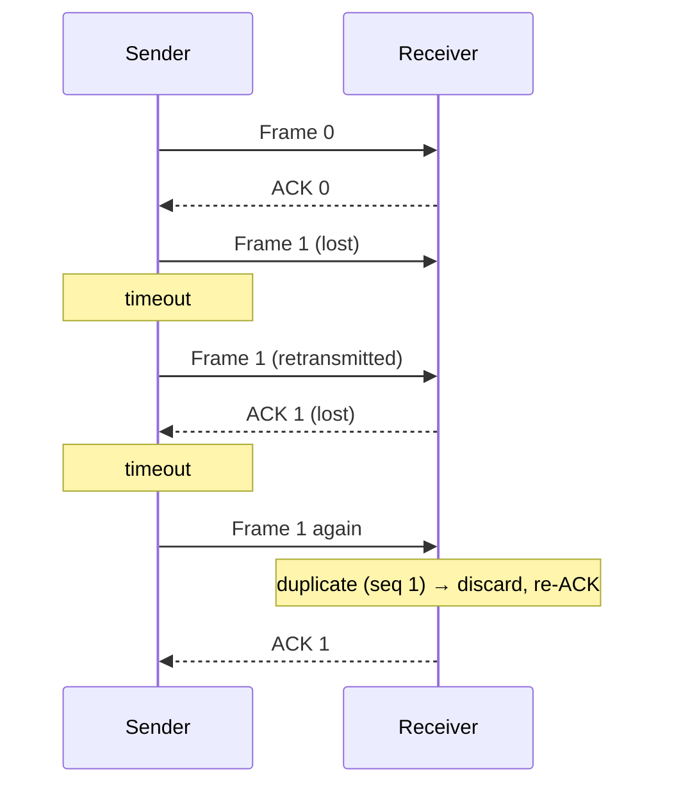

# 03.08 · Data Link Protocols and Elementary Protocols (Stop-and-Wait)

> [!info] [[03.00 Data Link Layer|Lesson 3]] · Lecture ref Ch3-L2 slides 26–27 · Priority 🟢 Low (not asked directly; needed to understand sliding window)

## 1. Where the DLL runs (lecture)
- *"Physical layer, data link layer, and network layer are **independent processes** that communicate by passing messages back and forth."*
- The **physical layer process and some of the DLL** run on dedicated hardware called a **NIC (Network Interface Card)**.
- The **rest of the link layer and the network layer** run on the **main CPU** as part of the **operating system**; the link-layer software is often a **device driver**.
- Other options: all three processes offloaded to a **network accelerator**, or all three on the main CPU in a **software-defined radio**.

```text
 Computer ┌────────────────────────────┐
          │ Application                │
          │ ┌── Operating system ─────┐│
          │ │ Network                 ││
          │ │ Link  ← driver          ││
          │ └─────────────────────────┘│
          │ Link + PHY ← NIC            │ ── cable (medium)
          └────────────────────────────┘
```

## 2. Three elementary protocols (lecture)

| Protocol | Assumptions | Behaviour |
|---|---|---|
| **1. Unrestricted simplex protocol** ("Utopia") | Data in **one direction**; channel **error-free**; receiver **infinitely fast** with infinite buffers | Sender just keeps sending; forwards messages to/from the network layer **without restrictions** |
| **2. Simplex stop-and-wait protocol** | Error-free channel, but the **receiver may be slow** | Sender sends **one frame, then waits** for a short **acknowledgement** before sending the next → simple **flow control** |
| **3. Simplex protocol for a noisy channel** | Frames can be **damaged or lost** | Needs an **acknowledgement scheme**, **timer** and **sequence numbers**: if no ACK arrives before the timeout, **retransmit**; sequence numbers (0/1 is enough) let the receiver discard duplicates |

> [!note] Additional explanation (textbook names)
> Protocol 3 is called **ARQ (Automatic Repeat reQuest)** or **PAR (Positive Acknowledgement with Retransmission)**. Its weakness: the sender sits **idle** waiting for each ACK, which wastes the link on long-delay channels (e.g. satellite). **Sliding window / pipelining** fixes this → [[03.09 Sliding Window and Go-Back-N]].

### Stop-and-wait over a noisy channel


## Related
[[03.03 Error Control and Flow Control]] · [[03.09 Sliding Window and Go-Back-N]] · [[03.01 Functions and Services of the Data Link Layer]]
