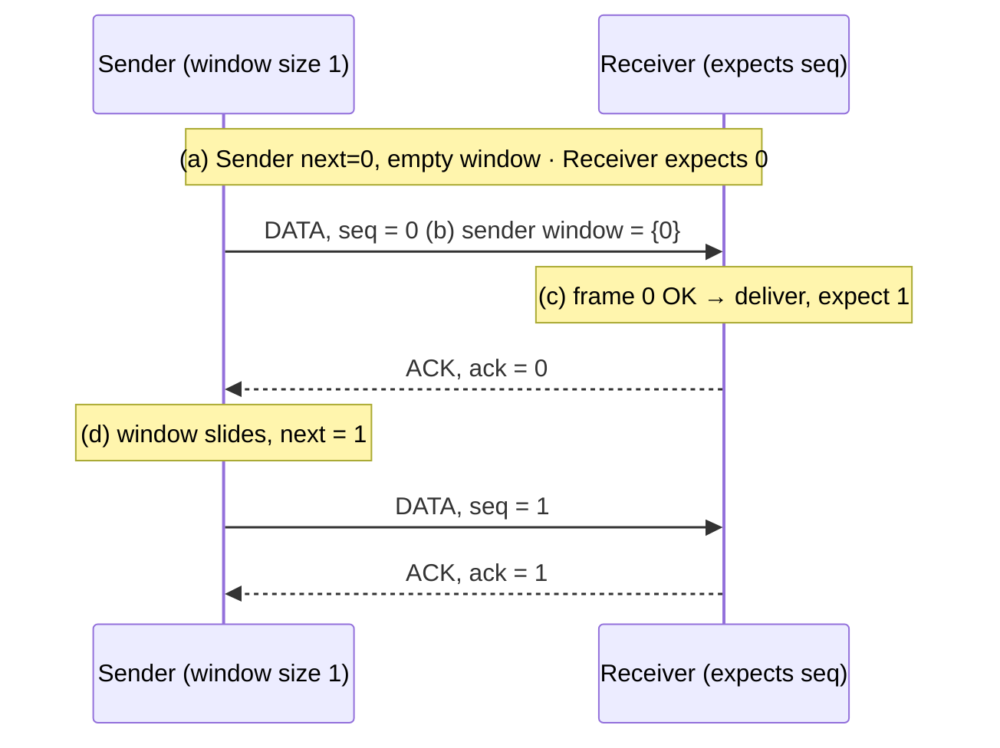

# 03.09 · Sliding Window Protocol and Go-Back-N

> [!info] [[03.00 Data Link Layer|Lesson 3]] · Lecture ref Ch3-L2 slides 28–29 · Priority 🟡 Medium (sliding window 2/6, Go-Back-N 2/6)
> **Asked as:** "Explain the Sliding Window Protocol used in the Data Link Layer from the initial state of the sender and receiver to the receipt of an acknowledgement message. Indicate the sequence numbers for Data and Acknowledgment messages" (2019/20 Q6d; 2022/23 Q5b "using diagrams") · "Data link layer uses protocols such as Go back-N, describe its behavior when the window size is 1. What happens if the receiver's window size is large?" (2020/21 Q6a, 2023/24 Q7c)

## 1. Sliding window: the idea
- Each outgoing frame has a **sequence number** from 0 to $2^n - 1$ (an n-bit field). The lecture uses **3 bits → 0 to 7**.
- The **sender's window** = the set of sequence numbers of frames it has **sent but not yet acknowledged** (or is permitted to send).
- The **receiver's window** = the set of frames it is **permitted to accept**.
- When an ACK arrives, the sender's window **slides forward**; when an expected frame arrives, the receiver's window slides forward. ACKs therefore give **error control and flow control** together ([[03.03 Error Control and Flow Control]]).

## 2. Lecture figure: window of size 1 with a 3-bit sequence number
The figure shows two dials (0–7) for sender and receiver; the shaded sector is the window.

| Step | Sender | Receiver | Messages |
|---|---|---|---|
| **(a) Initially** | Window **empty**; next frame to send = **0** | Window at **0** (expects frame 0) | — |
| **(b) After the first frame has been sent** | Window = **{0}** (frame 0 outstanding, timer running) | Still expects **0** | **DATA seq = 0** → |
| **(c) After the first frame has been received** | Still waiting, window {0} | Frame 0 accepted and passed to the network layer; window **slides to 1** | ← **ACK 0** |
| **(d) After the first acknowledgement has been received** | ACK 0 received → frame 0 removed; window **empty**, ready to send **frame 1** | Expects **1** | — |


With window size 1 this is **stop-and-wait** using sequence numbers. With larger windows the sender may have several frames outstanding (**pipelining**).

## 3. Go-Back-N: pipelining and error recovery
**Why:** on a long link (e.g. satellite), waiting for each ACK wastes time. **Pipelining** lets the sender transmit up to **w** frames before needing an ACK.

**The lecture figure:** frames 0, 1, 2, 3, … are pipelined; **frame 2 is damaged/lost** (marked E = error).

### (a) Receiver's window size = 1 → **Go-Back-N**
1. Frames 0 and 1 arrive correctly → ACK 0, ACK 1.
2. Frame 2 is lost (error).
3. The receiver **only accepts the next frame in order (2)**, so it **discards frames 3, 4, 5, 6, 7, 8** ("frames discarded by data link layer", marked D) and sends **no new ACKs** (it keeps acknowledging 1).
4. The sender's **timer for frame 2 expires** (timeout interval).
5. The sender **goes back** and **retransmits frame 2 and every frame after it** (2, 3, 4, 5, …).
6. **Advantage:** receiver is simple (no buffering). **Disadvantage:** **wastes bandwidth** on a high-error link, because many correct frames are resent.

### (b) Receiver's window size is large → **Selective Repeat**
1. Frame 2 is lost; frames 3, 4, 5, … arrive correctly.
2. The receiver **buffers** frames 3–8 ("frames buffered by data link layer") and sends a **NAK 2** (negative acknowledgement), while still acknowledging 1.
3. The sender **retransmits only frame 2**.
4. When frame 2 arrives, the receiver passes **2, 3, 4, …, 8** to the network layer **in order** and sends a cumulative **ACK 8**.
5. **Advantage:** only the bad frame is resent. **Disadvantage:** the receiver needs **buffer memory** and more complex logic.

```text
(a) Go-Back-N, receiver window 1
Sender:   0  1  2  3  4  5  6  7  8 │timeout│ 2  3  4  5  6 …
Receiver: 0  1  E  D  D  D  D  D  D           2  3  4  5  6 …
          (E = error, D = discarded)

(b) Selective repeat, receiver window large
Sender:   0  1  2  3  4  5  2  6  7  8 …
Receiver: 0  1  E  3  4  5  2  6  7  8 …   (3–5 buffered, NAK 2, deliver 2–5 together)
```

## 4. Comparison

| Feature | Stop-and-Wait | Go-Back-N | Selective Repeat |
|---|---|---|---|
| Sender window | 1 | w > 1 | w > 1 |
| Receiver window | 1 | **1** | **> 1** |
| Out-of-order frames at receiver | — | **Discarded** | **Buffered** |
| On error, resend | That frame | **That frame and all after it** | **Only the bad frame** |
| Bandwidth efficiency | Poor on long links | Good if errors are rare | **Best** |
| Receiver complexity / memory | Lowest | Low | **Highest** |

*(Textbook facts: Go-Back-N's sender window can be up to $2^n - 1$; Selective Repeat's windows at most $2^{n-1}$.)*

## 5. Exam relevance
- 🟡 Draw the **four-state diagram** (a)–(d) with sequence numbers, or the **two timelines** for Go-Back-N. Say clearly what happens to frames after the error in each case.

## Related
[[03.08 Elementary Data Link Protocols]] · [[03.03 Error Control and Flow Control]] · [[06.03 TCP Flow Control and Congestion Control]] (TCP's sliding window) · [[PP 03.3 - Sliding Window and Go-Back-N]]
