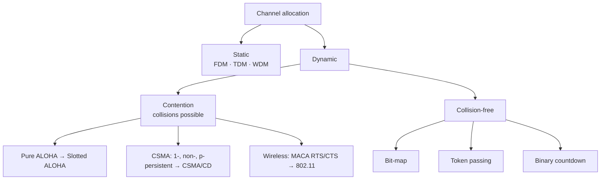

# 04 · The Medium Access Control (MAC) Sublayer

> [!info] Lesson map
> **Source:** Lecture deck *Chapter 4 – The Medium Access Control Sublayer* (32 slides) · [[00. CMIS 3114 Course Overview|Course Overview]]
> **Exam priority:** 🔴 **High.** One whole question (Q6 or Q7) in every paper since 2019/20: ALOHA vs CSMA, CSMA/CD states, collision-free protocols, hidden/exposed terminals + MACA.
> **Past questions:** [[PP 04.1 - ALOHA, CSMA and Collision-Free Protocols|PP 04.1]] · [[PP 04.2 - Wireless LAN Protocols and Standards|PP 04.2]]
> **Quick revision:** [[04.99 Summary - MAC Sublayer]]

## What this lesson is about
On a **broadcast (multi-access) channel**, many stations share one medium. If two transmit at once, their frames **collide**. The MAC sublayer decides **who may transmit when**. The lecture's analogy: in a conference call, *"after one person talks who should start next? ⇒ Chaos."*

## Topic structure
```text
MAC sublayer
├── DLL = LLC + MAC · MAC address (IEEE 802.3) · broadcast/multi-access channels
├── Channel allocation: static (TDM/FDM/WDM) vs dynamic (5 assumptions)
├── Contention protocols: Pure ALOHA · Slotted ALOHA · CSMA (1-persistent, non-persistent, p-persistent) · CSMA/CD
├── Collision-free protocols: bit-map · token passing · binary countdown
├── Wireless LAN protocols: hidden terminal · exposed terminal · MACA (RTS/CTS)
├── IEEE 802.11: infrastructure vs ad hoc · protocol stack (b, a, g, n) · frames · services (WEP/WPA/WPA2)
└── Broadband wireless: 802.16 WiMAX · vs WiFi, 4G LTE, 5G
```

## Notes in this lesson

| # | Note | Exam weight (papers out of 6) |
|---|---|---|
| 1 | [[04.01 Channel Allocation Problem]] | 🟢 (foundation) |
| 2 | [[04.02 ALOHA]] | 🔴 5/6 (with CSMA) |
| 3 | [[04.03 CSMA and CSMA-CD]] | 🔴 5/6 · CSMA/CD states 3/6 |
| 4 | [[04.04 Collision-Free Protocols]] | 🟡 3/6 (binary countdown identical twice) |
| 5 | [[04.05 Hidden and Exposed Terminals and MACA]] | 🔴 4/6 |
| 6 | [[04.06 IEEE 802.11 WiFi]] | 🟡 (WLAN, Li-Fi comparison, security essay) |
| 7 | [[04.07 Broadband Wireless - WiMAX, 4G and 5G]] | 🟢 1/6 |
| ★ | [[04.99 Summary - MAC Sublayer]] | Revision |

## The family tree of MAC protocols

**Reading it:** protocols improve step by step: ALOHA sends blindly; slotted ALOHA halves the vulnerable time; CSMA listens first; CSMA/CD also stops when it detects a collision; collision-free protocols avoid collisions completely; wireless needs MACA because the sender cannot hear collisions at the receiver.

## Related
- Old stub note (kept unchanged): [[3114-04 MAC Sub-layer]]
- Previous: [[03.00 Data Link Layer]] · Next: [[05.00 Network Layer]]
