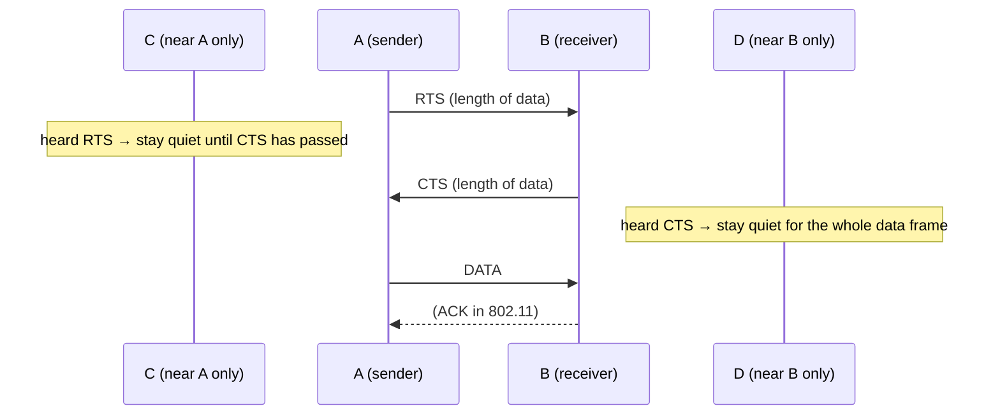

# 04.05 · Hidden and Exposed Terminal Problems, and MACA (RTS/CTS)

> [!info] [[04.00 MAC Sublayer|Lesson 4]] · Lecture ref Ch4 slides 21–24 · Priority 🔴 High (4/6 papers)
> **Asked as:** "In wireless LANs explain the Hidden and Exposed terminal problems. Propose a suitable protocol to solve the above problems" (2019/20 Q7d) · "…and propose a suitable solution" (2020/21 Q6c) · "Describe what is Hidden terminal problem and Exposed terminal problem" + "Give and explain a solution" (2021/22 Q7c,d) · "Describe using a diagram…" + "Provide a solution… and explain how it works" (2023/24 Q6c,d)

## 1. Why wireless is different
A wireless LAN is a **broadcast channel**: e.g. an office building with **access points (APs)** strategically placed, wired together with copper or fibre, connecting the stations that talk to them. Each station has a limited **radio range**.

**Key insight (lecture):** *"What matters for reception is **interference at the receiver, not at the sender**."* Carrier sensing at the sender (CSMA) only tells you what the sender hears, not what the receiver hears.

## 2. The hidden terminal problem
**Lecture:** *"A station **not being able to detect a potential competitor** for the medium because the competitor is **too far away**."*

```text
  (a) Hidden terminal: A and C both want to send to B

   ((( A ))) ───►  B  ◄─── ((( C )))        D
   └ A's range ┘     └ C's range ┘
   A can't hear C, C can't hear A, but B hears both
```
**Step by step:**
1. A is transmitting to B.
2. C (out of A's range) senses the channel: it hears **nothing** (A is hidden from C).
3. C starts sending to B.
4. The two signals **collide at B**: B receives garbage. A and C never know (they cannot hear each other).

## 3. The exposed terminal problem
**Lecture:** *"Hear a transmission and **falsely stop/refrain** from transmitting own data."*

```text
  (b) Exposed terminal: B sends to A; C wants to send to D

   A  ◄─── ((( B )))  ((( C ))) ───►  D
          B's range overlaps C
   C hears B, so it wrongly thinks it must stay quiet
```
**Step by step:**
1. B is transmitting to A.
2. C wants to send to D. C senses the channel and **hears B**, so it **defers**.
3. But C's transmission would only interfere near C and D; it would **not** affect A's reception (A is out of C's range). So C waited **unnecessarily**, wasting bandwidth.

| Hidden terminal | Exposed terminal |
|---|---|
| Station **fails to detect** a competitor (too far away) | Station **detects** a transmission it need not worry about |
| Result: **collision at the receiver** | Result: **unnecessary waiting**, lower throughput |
| CSMA senses "idle" wrongly | CSMA senses "busy" wrongly |

## 4. The solution: MACA (Multiple Access with Collision Avoidance)
**Idea:** let the **receiver** announce that it is about to receive, so everyone **near the receiver** stays quiet. Uses two short control frames.

### How it works (lecture), A wants to send to B
1. **A sends an RTS (Request To Send)** to B. This short frame (**30 bytes**) contains the **length of the data frame** that will follow.
2. **B replies with a CTS (Clear To Send)**, which also carries the data length.
3. On receiving the CTS, **A sends the data frame**.
4. **Any station hearing the RTS** is close to A and must **remain silent long enough for the CTS** to get back to A without conflict (in the lecture figure: **C and E**).
5. **Any station hearing the CTS** is close to B and must **remain silent during the upcoming data transmission**, whose length it can tell from the CTS (**D and E**).



### Why this solves both problems
- **Hidden terminal solved:** D (hidden from A) cannot hear A's RTS but **hears B's CTS**, so it stays quiet during the data transfer → no collision at B.
- **Exposed terminal solved:** C is within range of A but **not B**: *"it hears the RTS from A but not the CTS from B. As long as it does not interfere with the CTS, it is **free to transmit** while the data frame is being sent by A."* Hearing an RTS without a CTS means "I'm only near the sender", so it is safe to send.
- **Collisions can still happen** between two RTS frames sent at the same time; then both senders wait a random time and retry, but RTS frames are short, so little is wasted. (802.11 adds ACKs; this is **CSMA/CA**, *additional explanation*.)

## 5. Exam relevance
- 🔴 Draw the **two range diagrams** (A–B–C–D in a line) and the **RTS/CTS circles diagram**, then the 5 steps. State clearly **who stays silent and why**.

## Related
[[04.03 CSMA and CSMA-CD]] · [[04.06 IEEE 802.11 WiFi]] · [[01.05 Mobile Computing and Wireless Networks]] · [[PP 04.2 - Wireless LAN Protocols and Standards]]
