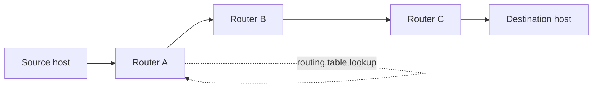

# 05 · The Network Layer

> [!info] Lesson map
> **Source:** Lecture decks *Chapter 5 – Network Layer L1* (18 slides: design issues and routing) and *L2* (17 slides: IP header, IP addresses, subnetting) · [[00. CMIS 3114 Course Overview|Course Overview]]
> **Exam priority:** 🔴 **High.** A **subnetting/IP allocation calculation appears in every paper (6/6)**. Q7 and Q8 of recent papers are network-layer: store-and-forward, flooding, sink tree, routing tables / virtual circuits / label switching, distance vector, classful counts, plus a network design scenario.
> **Past questions:** [[PP 05.1 - Store-and-Forward, Datagram and VC Networks|PP 05.1]] · [[PP 05.2 - Routing - Sink Tree, Flooding and Distance Vector|PP 05.2]] · [[PP 05.3 - IP Addressing and Subnetting|PP 05.3]] · [[PP 05.4 - Network Design Scenarios|PP 05.4]]
> **Quick revision:** [[05.99 Summary - Network Layer]]

## What this lesson is about
*"The network layer is concerned with getting packets from the **source all the way to the destination**. Getting to the destination may require making **many hops at intermediate routers** along the way."* Contrast: the data link layer only moves frames **across one link**.

## Topic structure
```text
Lecture 1: Design issues and routing
├── Design issues: store-and-forward · services to transport layer (3 goals)
│   · connectionless (datagrams, IP) · connection-oriented (virtual circuits, label switching, MPLS)
├── Virtual-circuit vs datagram networks (comparison table)
├── Routing algorithms: forwarding vs routing · properties · non-adaptive vs adaptive
├── Optimality principle · sink tree (hops)
├── Shortest path algorithm
├── Flooding (hop counter, sequence numbers)
└── Distance vector routing (router J example)
Lecture 2: The IP protocol
├── IPv4 header fields
├── IP addresses: 32 bits, dotted decimal, prefix /n, subnet mask (AND)
├── Classful addressing (A, B, C, D, E) · special addresses
└── Subnets and subnetting (largest block first)
```

## Notes in this lesson

| # | Note | Exam weight (papers out of 6) |
|---|---|---|
| 1 | [[05.01 Network Layer Design Issues]] | 🟡 store-and-forward 2/6, services 1/6 |
| 2 | [[05.02 Datagram and Virtual-Circuit Networks]] | 🟡 2/6 (routing tables, VC, label switching) |
| 3 | [[05.03 Routing Algorithms and the Sink Tree]] | 🔴 sink tree 4/6 |
| 4 | [[05.04 Shortest Path Routing]] | 🟢 0/6 |
| 5 | [[05.05 Flooding]] | 🟡 2/6 |
| 6 | [[05.06 Distance Vector Routing]] | 🟡 2/6 |
| 7 | [[05.07 IPv4 Header]] | 🟢 0/6 |
| 8 | [[05.08 IP Addresses and Classful Addressing]] | 🟡 (class counts 1/6; basis for subnetting) |
| 9 | [[05.09 Subnetting]] | 🔴 **6/6** |
| 10 | [[05.10 ARP and DHCP (Beyond the Slides)]] | ⚠️ not in slides |
| ★ | [[05.99 Summary - Network Layer]] | Revision |

## Forwarding a packet across routers

At each router: receive the whole packet (**store**), check it, look up the **destination** in the routing table (**forwarding**), send it on the chosen line (**forward**). The routing **algorithm** fills in those tables.

## Related
- Old stub note (kept unchanged): [[3114-05 Network Layer]]
- Previous: [[04.00 MAC Sublayer]] · Next: [[06.00 Transport Layer]]
