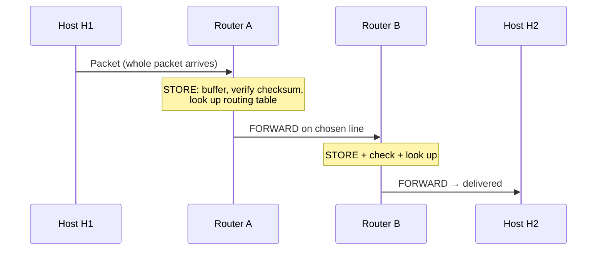

# 05.01 · Network Layer Design Issues: Store-and-Forward and Services to the Transport Layer

> [!info] [[05.00 Network Layer|Lesson 5]] · Lecture ref Ch5-L1 slides 2–4 · Priority 🟡 Medium
> **Asked as:** "Describe the Store-and-forward packet switching mechanism used for network communication" (2021/22 Q8a, 2023/24 Q7a) · "What are the services provided by the Network layer to the Transport layer in OSI reference model?" (2022/23 Q7a)

## 1. Design issue 1: store-and-forward packet switching

**Lecture, step by step:**
1. *"A host with a packet to send transmits it to the **nearest router**, either on its own LAN or over a point-to-point link to the ISP."*
2. *"The packet is **stored there until it has fully arrived** and the link has finished its processing by **verifying the checksum**."*
3. *"Then it is **forwarded to the next router** along the path"*
4. *"…until it reaches the destination host, where it is delivered."*

**Why "store" first?** The router must have the **complete packet** to verify the **checksum** (discard corrupted packets) and read the **destination address**; it may also need to **queue** the packet until the output line is free (from Ch1: *"stored there until the required output line is free, and then forwarded"*).

| Advantages | Disadvantages |
|---|---|
| Corrupted packets are **caught at each hop** | **Delay** at every hop (must wait for the whole packet) |
| Lines are **shared** efficiently; no dedicated path | Routers need **buffer memory**; packets may be **dropped** when buffers fill (congestion) |
| Each router decides independently → can **route around failures** | Variable delay; packets may arrive out of order |

See also [[01.09 Network Classification by Scale]] (WAN store-and-forward subnet) and [[02.09 Switching - Circuit, Message and Packet]].

## 2. Design issue 2: services provided to the transport layer
The network layer provides services at the **network layer / transport layer interface**. **Goals** (lecture):
1. **The services should be independent of the router technology.**
2. **The transport layer should be shielded from the number, type, and topology of the routers present.**
3. **The network addresses made available to the transport layer should use a uniform numbering plan, even across LANs and WANs.**

**What the services are:** delivering packets from the source host to the destination host, either as a **connectionless** service (datagrams, **IP**) or a **connection-oriented** service (**virtual circuits**, **MPLS**). These are design issues 3 and 4 → [[05.02 Datagram and Virtual-Circuit Networks]].

> [!tip] Answer for 2022/23 Q7(a)
> State the **three goals**, then explain the **two kinds of service**: connectionless (no setup, each packet = datagram carrying the full destination address, routed independently, e.g. IP) and connection-oriented (a virtual circuit is set up first, packets carry a short VC identifier, e.g. MPLS). Mention routing, addressing (uniform IP numbering) and hiding the subnet from the transport layer.

## Related
[[05.02 Datagram and Virtual-Circuit Networks]] · [[05.03 Routing Algorithms and the Sink Tree]] · [[01.15 OSI Reference Model]] · [[PP 05.1 - Store-and-Forward, Datagram and VC Networks]]
