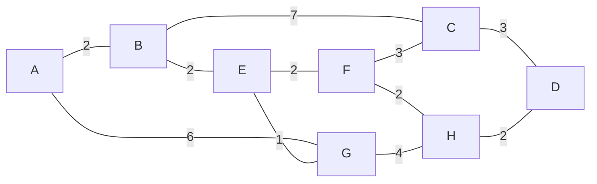

# 05.04 · Shortest Path Routing (Dijkstra)

> [!info] [[05.00 Network Layer|Lesson 5]] · Lecture ref Ch5-L1 slide 16 · Priority 🟢 Low (not asked; the idea underlies sink trees and link state routing)

## 1. Lecture idea
*"Using a metric such as the **number of hops, distance, mean delay** etc., build a **graph** of the network, with each **node** representing a **router** and each **edge** representing a **communication line, or link**."* Then find the path with the **lowest total cost** between two routers.

## 2. Algorithm (Dijkstra, 1959): additional explanation from the reference textbook
**Inputs:** weighted graph, source router. **Output:** least-cost path and cost to every router.
1. Label the source with distance 0 (**permanent**); every other node: ∞ (tentative).
2. **Working node** = the node just made permanent. For each neighbour of the working node, compute *working distance + link cost*. If this is smaller than the neighbour's current label, **relabel** it (store the distance **and** the predecessor).
3. Among all **tentative** nodes, make the one with the **smallest label permanent**; it becomes the new working node.
4. Repeat steps 2–3 until the destination (or all nodes) is permanent.
5. Read the path **backwards** using the stored predecessors.

## 3. Worked example: the lecture graph, A → D
Links (from the slide): A–B 2, A–G 6, B–C 7, B–E 2, E–G 1, E–F 2, F–C 3, F–H 2, G–H 4, C–D 3, H–D 2.

| Step | Made permanent | Tentative labels after relaxing (distance, via) |
|---|---|---|
| 1 | **A (0)** | B (2, A), G (6, A) |
| 2 | **B (2)** | E (4, B), C (9, B), G (6, A) |
| 3 | **E (4)** | G (5, E) ← improved, F (6, E), C (9, B) |
| 4 | **G (5)** | H (9, G), F (6, E), C (9, B) |
| 5 | **F (6)** | H (8, F) ← improved, C (9, B or F) |
| 6 | **H (8)** | D (10, H), C (9) |
| 7 | **C (9)** | D stays 10 (9 + 3 = 12 is worse) |
| 8 | **D (10)** | done |

**Shortest path A → D = A → B → E → F → H → D, cost 10.**

## 4. Where it is used
**Link state routing** (e.g. OSPF): each router learns the whole topology and runs Dijkstra locally. *(Not covered further in the CMIS 3114 slides.)*

## 5. Distance vector vs link state *(comparison requested in the study brief; link state is textbook material)*
| Distance vector | Link state |
|---|---|
| Each router tells **neighbours** its whole distance table | Each router floods **link costs to all** routers |
| Router knows only distance + next hop | Router knows the **whole topology** and runs Dijkstra |
| Bellman-Ford style; simple | More memory/CPU |
| Slow convergence; **count-to-infinity** problem | Fast convergence, no count-to-infinity |
| e.g. RIP, the old ARPANET | e.g. OSPF, IS-IS |

## Related
[[05.03 Routing Algorithms and the Sink Tree]] · [[05.06 Distance Vector Routing]] · [[05.05 Flooding]] · [[3114 Important Algorithms]]
