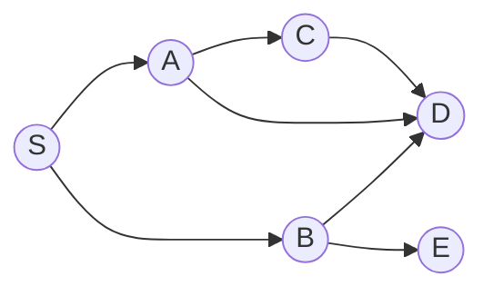

# 05.05 · Flooding

> [!info] [[05.00 Network Layer|Lesson 5]] · Lecture ref Ch5-L1 slide 17 · Priority 🟡 Medium (2/6 papers)
> **Asked as:** "'Flooding' is a technique used for communication in computer networks. Describe methods of limiting the negative effects of this technique" (2021/22 Q8b) · "Define message flooding in computer networks. Explain two techniques that can be used to control flooding congestion" (2023/24 Q7b)

## 1. What is it?
**Lecture:** *"Every incoming packet is sent out on **every outgoing line except the one it arrived on**."*

It needs **no routing table and no knowledge of the topology**. It is a **static** routing algorithm.

*S floods to A and B; A floods to C and D; B to D and E; D already received a copy from A, so B's copy is a **duplicate**, and so on.*

## 2. The problem
*"Generates **vast numbers of duplicate packets**,"* in fact an infinite number on a network with loops unless stopped, so it *"needs a method to **damp** the process."* Duplicates waste bandwidth and create **congestion**.

## 3. Two damping techniques (lecture)

### Technique 1: hop counter
1. The source puts a **hop counter** in the header of each packet, initialised to the length of the path (worst case: the **network diameter**).
2. **Each router decrements** the counter.
3. When the counter **reaches zero, the packet is discarded**.
Limits how far copies can travel. (This is the same idea as IP's **TTL** field, [[05.07 IPv4 Header]].)

### Technique 2: sequence numbers (track flooded packets)
1. **Each source router puts a sequence number** in every packet it receives from its hosts.
2. **Each router keeps a list per source router** of the sequence numbers **already seen** from that source.
3. When a packet arrives whose (source, sequence number) is **already in the list**, it is **not flooded again** (discarded).
4. *(Textbook detail)* To keep the list short, a counter k means "all numbers up to k have been seen".

A third improvement *(textbook)*: **selective flooding**: send only on lines going roughly in the right direction.

## 4. Advantages and uses
| Advantages | Disadvantages |
|---|---|
| **Always finds the shortest path** (one copy takes it), so lowest possible delay | **Huge number of duplicates**, bandwidth waste, congestion |
| **Extremely robust**: if any path exists, the packet gets through (military, disasters) | Needs damping (hop count / sequence numbers) |
| No routing tables needed; useful for **broadcasting** routing updates (link state) and as a benchmark | Not practical for most data traffic |

## Related
[[05.03 Routing Algorithms and the Sink Tree]] · [[05.04 Shortest Path Routing]] · [[05.07 IPv4 Header]] (TTL) · [[PP 05.2 - Routing - Sink Tree, Flooding and Distance Vector]]
