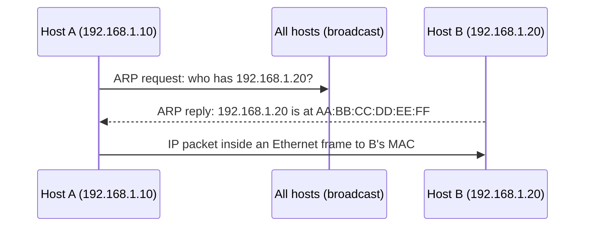

# 05.10 · ARP, DHCP and Switch MAC Learning (Beyond the Slides)

> [!warning] Not in the CMIS 3114 lecture slides
> ARP, DHCP and switch learning are **not covered** in the Chapter 1–5 slides and have **not appeared** in the six past papers. They are included because they explain how the IP addresses ([[05.08 IP Addresses and Classful Addressing]]) and MAC addresses ([[04.01 Channel Allocation Problem]]) work together in a real LAN, and they help with **network design** answers. Additional explanation from the reference textbook (Tanenbaum 6e, Ch5).

## 1. ARP: Address Resolution Protocol
**Problem:** IP routes by **IP address**, but on an Ethernet/WiFi LAN a frame must carry the destination's **48-bit MAC address**. How does a host find the MAC address for an IP address on its own LAN?

**Step by step** (host 192.168.1.10 sends to 192.168.1.20 on the same LAN):
1. The sender checks its **ARP cache**. If the IP→MAC mapping is there, use it.
2. If not, it **broadcasts an ARP request** frame (destination MAC FF:FF:FF:FF:FF:FF): *"Who has 192.168.1.20? Tell 192.168.1.10."*
3. Every host on the LAN receives it; only the host owning 192.168.1.20 replies.
4. That host sends a **unicast ARP reply**: *"192.168.1.20 is at AA:BB:CC:DD:EE:FF."*
5. The sender **caches** the mapping and sends the frame.
6. If the destination is on **another network**, the host ARPs for its **default gateway (router)** instead and sends the frame to the router.

## 2. DHCP: Dynamic Host Configuration Protocol
**Problem:** a new device needs an **IP address, subnet mask, default gateway and DNS server** without manual configuration.

**DORA, step by step:**
1. **Discover:** the new client broadcasts *"Is there a DHCP server?"* (it has no IP yet, so source 0.0.0.0, the "this host" special address).
2. **Offer:** the server offers an IP address from its pool plus mask, gateway, DNS and a **lease time**.
3. **Request:** the client broadcasts that it accepts that offer.
4. **Acknowledge:** the server confirms; the client configures itself. Before the lease expires it renews.

In design questions, the **router or a server** in the ICT/IT department can act as the DHCP server for every department subnet.

## 3. How a switch learns MAC addresses
1. A frame arrives on port 3 from MAC X → the switch records **"X is on port 3"** in its **MAC address table**.
2. It looks up the destination MAC: if known, it forwards **only to that port** (filtering); if unknown (or broadcast), it **floods** the frame to all other ports.
3. Entries age out if not refreshed, so moved devices are relearned.

**Hub vs switch vs router:** a hub repeats bits to all ports (layer 1); a switch forwards frames by **MAC** within one LAN (layer 2); a router forwards packets **between networks** by **IP** (layer 3). **Bridge vs switch:** both are layer-2 devices that learn MAC addresses; a bridge typically connects a few LAN segments in software, while a switch has many ports and forwards in hardware.

## Related
[[05.08 IP Addresses and Classful Addressing]] · [[01.07 Network Hardware and Transmission Technology]] · [[07.01 DNS]] · [[PP 05.4 - Network Design Scenarios]]
