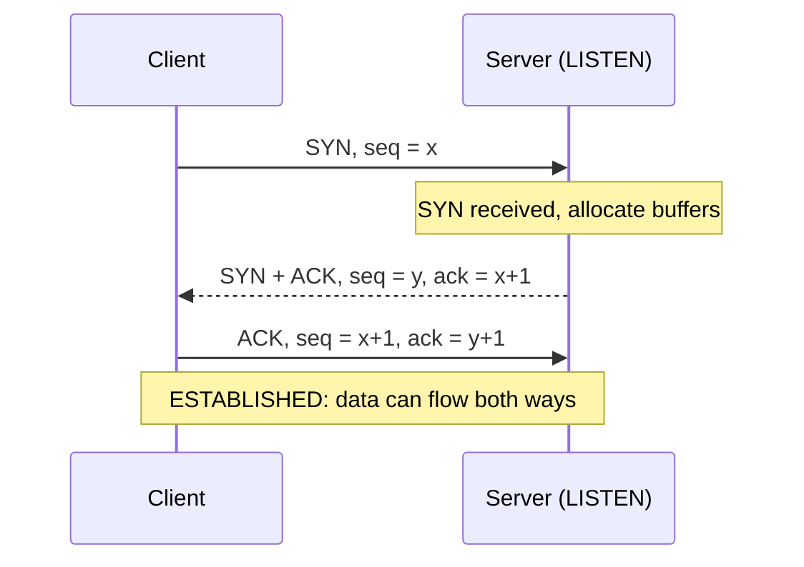
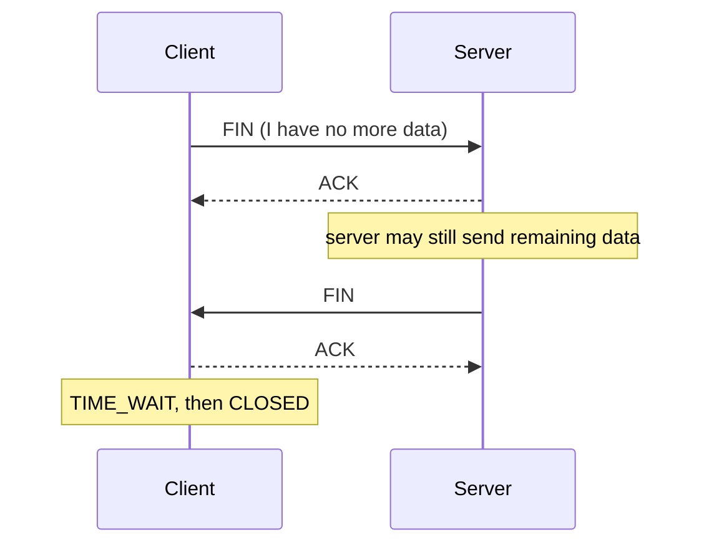

# 06.02 · TCP Connection Management: Establishment, Transfer, Release

> [!warning] Not in the available CMIS 3114 slides
> Additional explanation from the reference textbook (Tanenbaum 6e §6.5). Not examined in the six past papers. The closest lecture content is **service primitives** ([[01.14 Service Primitives]]), which TCP implements.

## 1. Connection establishment: three-way handshake

1. **Client → SYN (seq = x):** "I want to connect; my starting sequence number is x." (CONNECT primitive)
2. **Server → SYN-ACK (seq = y, ack = x+1):** "I accept (ACCEPT); my starting number is y; I expect byte x+1 next."
3. **Client → ACK (ack = y+1):** "Got your SYN." Both sides are now **ESTABLISHED**.

**Why three messages?** Both sides must **choose and confirm** their initial sequence numbers. The third message also protects against **old delayed duplicate** SYNs creating false connections.

## 2. Data transfer
1. The sender splits the byte stream into **segments**, each with a sequence number (byte position).
2. The receiver returns **cumulative ACKs** ("next byte I expect").
3. Unacknowledged segments are **retransmitted** after a timeout.
4. The receiver **reorders** segments and removes duplicates before delivering the stream to the application.

## 3. Connection release (four-way, each direction closed separately)

Each side sends **FIN** when it has finished sending and the other **ACKs** it. The connection is fully closed when both directions are closed. This maps to the **DISCONNECT** phases 8–9 in [[01.14 Service Primitives]].

## Example
Opening `https://www.example.com`: DNS lookup ([[07.01 DNS]]) → TCP 3-way handshake to port 443 → TLS setup → HTTP request/response ([[07.02 HTTP and the Web]]) → FIN/ACK release.

## Related
[[06.01 TCP vs UDP]] · [[06.03 TCP Flow Control and Congestion Control]] · [[01.14 Service Primitives]]
