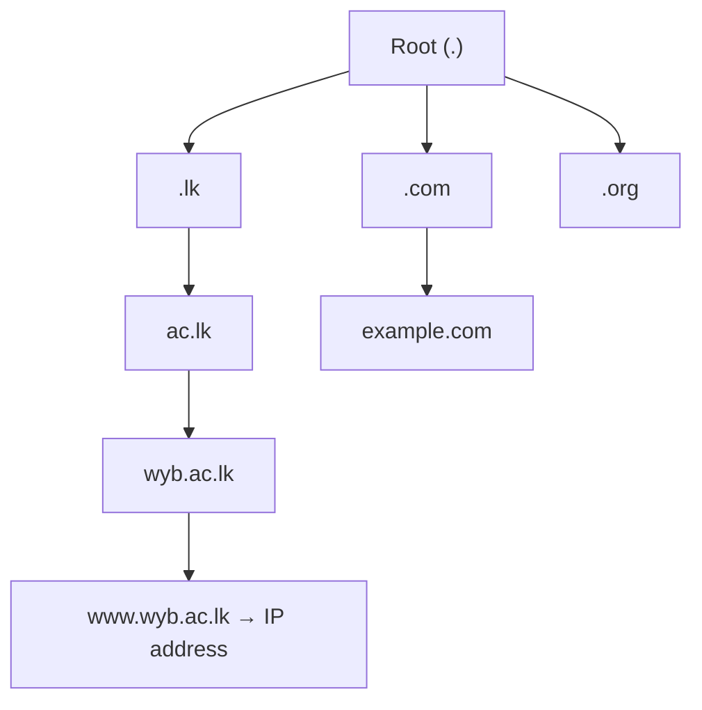
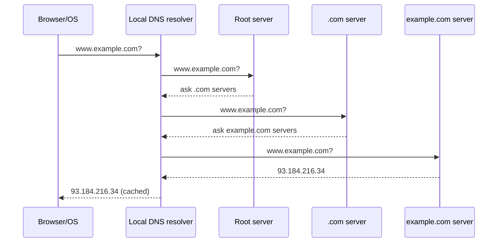

# 07.01 · DNS: Domain Name System

> [!warning] Not in the available CMIS 3114 slides
> Named in the Ch1 slides (TCP/IP application layer) and required as a **DNS server** in network-design questions. Detail below is additional explanation from the reference textbook (Tanenbaum 6e §7.1).

## 1. What is it and why is it needed?
People remember names (`www.wyb.ac.lk`); routers need **IP addresses**. **DNS** is a **distributed, hierarchical database** that translates **domain names into IP addresses** (and holds mail-server records, etc.). It is distributed because no single server could handle the whole Internet's queries.

## 2. The hierarchy

Root servers → **top-level domains** (generic .com/.org, country .lk) → second-level domains → hosts. Each zone is managed by its own **authoritative name server**.

## 3. DNS resolution, step by step (www.example.com)
1. **User types** `www.example.com` in the browser.
2. **Local check:** the browser and OS look in their **DNS cache** (and the hosts file). If found, skip to step 7.
3. **Query to the resolver:** the OS sends a query (usually **UDP port 53**) to its configured **local DNS resolver** (the ISP's or the organisation's DNS server; given by DHCP).
4. **Resolver asks a root server:** "Where is .com?" → root replies with the **.com TLD servers**.
5. **Resolver asks a .com TLD server:** "Where is example.com?" → replies with **example.com's authoritative name servers**.
6. **Resolver asks the authoritative server:** "What is www.example.com?" → replies with the **IP address** (an A record). The resolver **caches** the answer (for its TTL) and returns it to the client.
7. **Browser connects** to that IP address (TCP handshake, then HTTP).

Steps 4–6 are **iterative** queries by the resolver; the client's request to the resolver is **recursive** (it wants the final answer).

## 4. In a network design answer
Place the **DNS server in the ICT/IT department server area** (behind the firewall), give its address to all departments via DHCP, and let it **cache** lookups to speed up browsing and reduce Internet traffic.

## Related
[[07.02 HTTP and the Web]] · [[06.01 TCP vs UDP]] · [[PP 05.4 - Network Design Scenarios]]
