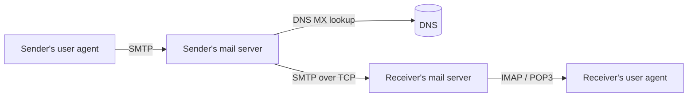

# 07.03 · E-mail Delivery: SMTP, POP3 and IMAP

> [!warning] Not in the available CMIS 3114 slides
> The Ch1 slides list e-mail as a business/home use and **SMTP** as an application-layer protocol. Detail below is additional explanation from the reference textbook (Tanenbaum 6e §7.2).

## 1. Components
| Component | Role |
|---|---|
| **User agent** | The mail program/app (Outlook, Gmail web, phone app) used to write and read mail |
| **Mail server (message transfer agent)** | Stores mailboxes and relays mail between domains |
| **SMTP** (Simple Mail Transfer Protocol) | **Sends/pushes** mail: user agent → own server, and server → server (TCP 25/587) |
| **POP3** / **IMAP** | **Retrieve/pull** mail from your mailbox (POP3 downloads; IMAP keeps mail on the server and syncs folders) |

## 2. Delivery, step by step (kasun@wyb.ac.lk → nimali@gmail.com)
1. Kasun writes the message in his **user agent** and clicks Send.
2. The user agent submits it with **SMTP** to the **wyb.ac.lk mail server**, which queues it.
3. The wyb server does a **DNS lookup for the MX (mail exchanger) record** of gmail.com to find Gmail's mail server.
4. It opens a **TCP connection** to Gmail's server and transfers the message with **SMTP** (HELO, MAIL FROM, RCPT TO, DATA, QUIT).
5. Gmail's server stores it in **Nimali's mailbox**.
6. Nimali's app retrieves it using **IMAP** (or POP3, or HTTPS for webmail).

## Related
[[07.01 DNS]] · [[01.03 Uses of Computer Networks]] · [[06.01 TCP vs UDP]]
