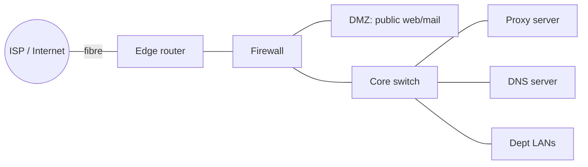

# 08.01 · Security Fundamentals, Cryptography, Firewalls and Proxies

> [!warning] Not in the available CMIS 3114 slides
> Additional explanation from the reference textbook (Tanenbaum 6e Ch. 8), written to support the **security essay** and **network design** questions.

## 1. Security goals (CIA + 2)
| Goal | Meaning | Example control |
|---|---|---|
| **Confidentiality** | Only authorised people can read data | Encryption (AES, WPA2, HTTPS) |
| **Integrity** | Data not altered in transit | Hashes, MACs, digital signatures |
| **Availability** | Service is up when needed | Redundancy, DoS protection, backups |
| **Authentication** | Prove who you are | Passwords, 2FA, certificates, SIM keys |
| **Non-repudiation** | Sender can't deny sending | Digital signatures |

## 2. Common threats
**Eavesdropping/sniffing** (especially on WiFi), **spoofing** (fake IP/MAC/e-mail), **man-in-the-middle**, **malware** (viruses, worms, ransomware), **phishing** and **identity theft** (Ch1 social issues), **denial of service (DoS/DDoS)**, **password cracking** (e.g. WEP, Ch4).

## 3. Cryptography: symmetric vs asymmetric
| | Symmetric (secret key) | Asymmetric (public key) |
|---|---|---|
| Keys | **One shared secret key** for encrypt and decrypt | **Public key** encrypts, **private key** decrypts (pair) |
| Speed | **Fast** | Slow |
| Problem | **Key distribution**: how to share the key safely | Solves key distribution; enables **digital signatures** |
| Examples | **AES** (WPA2), DES/3DES | **RSA**, Diffie–Hellman, ECC |
| In practice | Bulk data encryption | Exchange the symmetric key (e.g. TLS/HTTPS uses both) |

## 4. Firewalls and proxy servers (design questions)
- **Firewall:** a device/software at the **boundary between the internal network and the Internet** that **filters packets by rules** (allowed IP addresses, ports, protocols, connection state). Blocks unwanted incoming connections; can restrict outgoing traffic. Placement: **between the ISP router and the internal network**, often with a **DMZ** for public servers.
- **Proxy server:** an intermediary that makes **web requests on behalf of clients**. Benefits: **caching** (faster browsing, less ISP bandwidth), **content filtering/access control**, **hides internal addresses**, logging.
- **VPN:** an encrypted tunnel over the Internet so remote users/branches act as if on the internal LAN.
- **IDS/IPS:** detect/prevent suspicious traffic patterns.

## 5. Wireless security (lecture, Ch4)
**WEP** (pre-shared key, easily cracked) → **WPA2** (AES encryption; authentication server or pre-shared key; challenge–response after association). See [[04.06 IEEE 802.11 WiFi]].

## Related
[[01.06 Social Issues of Computer Networks]] · [[PP 01.3 - Social and Technical Essays]] · [[PP 05.4 - Network Design Scenarios]]
