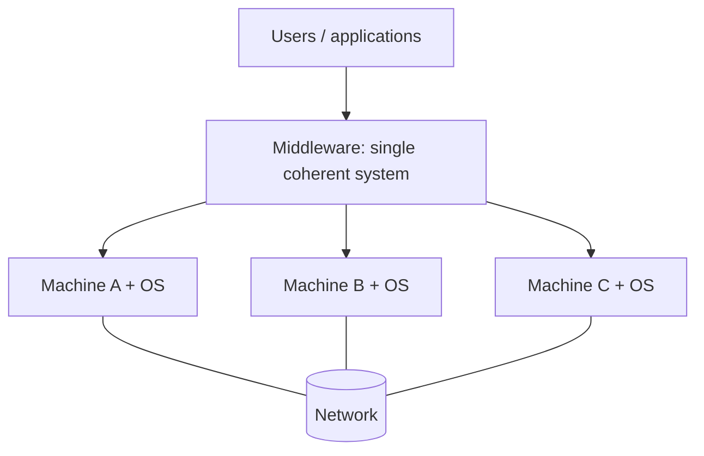

# PP 01.1 · Computer Networks, Uses, Distributed Systems, Client–Server and P2P

> [!info] Lessons: [[01.01 Computer Networks]] · [[01.02 Distributed Systems]] · [[01.03 Uses of Computer Networks]] · [[01.04 Client-Server and Peer-to-Peer Models]] · Summary: [[01.99 Summary - Introduction]] · Map: [[3114 Past Paper Mapping]]
> **Marks:** none of the six papers print marks per sub-question, so none are given here.

| Paper | Q | Topic |
|---|---|---|
| 2018/19 | 1(a) | Networks in a pandemic |
| 2018/19 | 1(b) | Distributed vs client–server systems |
| 2019/20 | 1(a) | Define network; part of daily life |
| 2019/20 | 1(b) | P2P vs client–server |
| 2019/20 | 1(d) | Restore Sri Lanka's economy (3 examples) |
| 2020/21 | 1(a) | Define network; advantages and disadvantages |
| 2020/21 | 1(b) | Distributed system: advantages, disadvantages, example |
| 2020/21 | 1(c)(ii) | Short note: peer-to-peer networks |
| 2021/22 | 1(a) | Define network; 4 reasons |
| 2021/22 | 1(c)(i) | Short note: distributed system |
| 2022/23 | 1(a) | Four reasons networks are required |
| 2022/23 | 1(b) | P2P vs client–server: differences and similarities |
| 2022/23 | 1(c)(i) | Short note: distributed system |
| 2023/24 | 1(a) | Four usages of computer networks |
| 2023/24 | 1(b) | Distributed system with diagram |

---

## A. Define a computer network / reasons / advantages and disadvantages

> **2019/20 Q1(a):** Define what is a computer network and how it has become a part of the daily life.
> **2020/21 Q1(a):** Define what is a computer network and discuss its advantages and disadvantages.
> **2021/22 Q1(a):** Define the term "Computer Network". Describe the 4 reasons as to why *Computer Networks* are required.
> **2022/23 Q1(a):** Describe four (4) reasons, why *Computer Networks* are required.

**Related topic:** [[01.01 Computer Networks]]

### Expected answer
A **computer network** is *"a collection of autonomous computers interconnected by a single technology"*: the interconnection of **two or more independent computers** that are able to **exchange information** (over copper, fibre, radio, satellite, etc.).

**Four reasons networks are required:**
1. **Resource sharing:** hardware (printers, disks), software and especially **data** are available to anyone on the network regardless of location (e.g. one printer shared by an office).
2. **Robustness / reliability:** fault tolerance through **redundancy**: if one machine fails, another copy of the data or service takes over.
3. **Load balancing:** processing and data can be **distributed** over many machines.
4. **Location independence / communication:** users access their files from **anywhere** on the network, and people communicate by e-mail, video conferencing, etc.

**Disadvantages (2020/21):** **security**: distributed resources are harder to protect than centralised ones, and the network itself is a target; also cost of equipment and administration, rapid spread of malware, privacy risks (cookies, identity theft), dependence on the network.

**Part of daily life (2019/20):** online banking and payments, e-commerce, e-mail and social media, online education, entertainment (video on demand, IPTV), mobile phones and navigation, work from home.

### Key points to include
- Lecture definition (autonomous/independent computers, able to exchange information).
- Four reasons by name, each with an example.
- At least one disadvantage = **security** (lecture's "problem").

### Exam approach
Definition (2 lines) → numbered reasons with examples → disadvantages. A small diagram of PCs, a printer and a server on a switch earns easy credit.

---

## B. Applied uses: pandemic, economy, four usages

> **2018/19 Q1(a):** Describe how computer networks support daily life in a pandemic situation.
> **2019/20 Q1(d):** Sri Lanka is currently facing an economic crisis. Using **Three** examples, explain how computer networks can be utilized to restore the economy in Sri Lanka.
> **2023/24 Q1(a):** Describe four (4) usages of Computer Networks.

**Related topic:** [[01.03 Uses of Computer Networks]]

### Expected answer: four usages (2023/24)
1. **Business applications / resource sharing:** programs, printers and especially data shared regardless of location; company databases of customers, inventory and accounts.
2. **Communication:** e-mail, instant messaging, video conferencing, VoIP, social networks; employees far apart writing a report together.
3. **E-commerce:** doing business with consumers (B2C, online shopping, banking) and with other businesses (B2B, real-time ordering that reduces inventories); online auctions (C2C).
4. **Access to remote information and entertainment:** web browsing, online newspapers and digital libraries, video on demand, IPTV, games.
(Also: **mobile users** staying connected while travelling.)

### Expected answer: pandemic (2018/19)
- **Work from home:** VPN/remote access, e-mail and video conferencing keep businesses running.
- **Online education:** LMS, recorded and live lectures, online exams.
- **E-commerce and delivery:** online ordering of groceries and medicines.
- **Online banking/payments:** no need to visit banks.
- **Health services:** telemedicine, doctor channelling, health information.
- **Social contact and entertainment:** social networks, VoIP calls, streaming.

### Expected answer: economy (2019/20)
1. **E-commerce and exports (B2C/B2B):** local producers sell directly to foreign buyers online, earning foreign exchange.
2. **IT/BPO services and remote work:** freelancers and software firms export services over the Internet; real-time ordering cuts manufacturers' inventory costs.
3. **E-government and digital payments:** online services reduce travel, fuel and paperwork; digital payments improve efficiency and tax collection. *(Alternatives: tourism promotion and online booking, e-learning to upskill workers, telemedicine.)*

### Key points to include
- Name the **category of use** (business / home / mobile), the **service**, a **concrete example**, and the **benefit**.

### Exam approach
Use headings, one paragraph per example. For "three examples", give exactly three well-developed ones.

---

## C. Distributed systems

> **2018/19 Q1(b):** Describe the differences between Distributed systems and client-server systems.
> **2020/21 Q1(b):** Describe what is a Distributed System and its advantages and disadvantages giving an example.
> **2021/22 Q1(c)(i) and 2022/23 Q1(c)(i):** Write short notes on following topics describing their benefits and issues: Distributed system.
> **2023/24 Q1(b):** Explain with a diagram what is a Distributed System. Discuss its advantages and disadvantages giving an example.

**Related topic:** [[01.02 Distributed Systems]]

### Expected answer
A **distributed system** is a collection of **independent computers that appears to its users as a single coherent system**. It is a **software system built on top of a network**, usually presenting **one model or paradigm**; a layer of software above the operating systems, **middleware**, implements this model. Example: the **World Wide Web**, where everything looks like a document; it runs **on top of the Internet**. Other examples: cloud storage (Google Drive), online banking systems.

| Advantages / benefits | Disadvantages / issues |
|---|---|
| Resource sharing; transparency (looks like one system) | Complex middleware, harder to design and debug |
| Reliability: one machine fails, others continue | Security: many machines and links to protect |
| Scalability: add machines | Depends on the network: slow/broken network → slow system |
| Performance through parallel processing | Keeping replicated data consistent |

**Distributed system vs client–server (2018/19):**
| Distributed system | Client–server system |
|---|---|
| Many computers appear as **one** coherent system (transparency) | Distinct roles: **clients request**, **servers reply** |
| Location of data/processing **hidden** from the user | Client explicitly contacts a known server |
| Work spread over many nodes | Data centralised on powerful servers |
| Middleware provides a single model | Two processes exchange request–reply messages |

### Key points to include
- "Independent computers … single coherent system", **middleware**, **Web example**, diagram, 2–3 pros and 2–3 cons.

### Exam approach
Definition → diagram → table of advantages/disadvantages → example. For "differences", use a table.

---

## D. Peer-to-peer vs client–server

> **2019/20 Q1(b):** Compare and contrast between Peer-to-Peer and Client-Server network models.
> **2022/23 Q1(b):** What are the differences and similarities between Peer-to-Peer and Client-Server network models?
> **2020/21 Q1(c)(ii):** Write short notes on following topics describing their benefits and issues: Peer-to-peer networks.

**Related topic:** [[01.04 Client-Server and Peer-to-Peer Models]]

### Expected answer
**Client–server:** data stored on powerful **servers**, centrally maintained by an administrator; users have simpler **clients**. Two processes: the client **sends a request** and waits; the server performs the work and **sends a reply** (e.g. browser and web server).
**Peer-to-peer:** **no fixed division into clients and servers**; every host can act as **both** client and server, communicating within a loose group (e.g. **BitTorrent**, consumer-to-consumer online auctions).

| | Client–server | Peer-to-peer |
|---|---|---|
| Roles | Fixed | Every node is both |
| Data | Centralised | Distributed |
| Control/security | Central admin; easier to secure/back up | No central control; harder to secure |
| Cost | Servers + admin staff | Low |
| Failure | Server = single point of failure | No single point of failure |
| Scalability | Server can be a bottleneck | More peers = more capacity |

**Similarities:** both share resources and support communication over the same network and protocols; both exchange messages between processes; both are used for e-commerce and file sharing.

**P2P benefits/issues (short note):** benefits: cheap, no server, robust, scales with users, efficient file distribution. Issues: security and malware, illegal sharing (copyright: a lecture social issue), no central backup/management, performance depends on peers being online.

### Exam approach
Two definitions + diagram of each + 5–6 row table + similarities + example of each.
