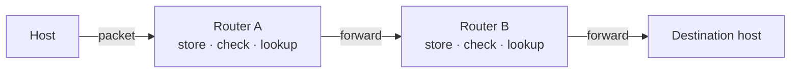
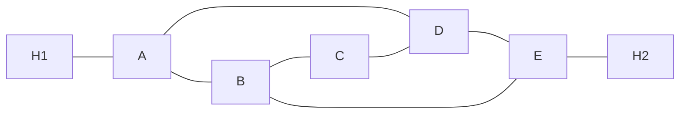

# PP 05.1 · Store-and-Forward, Services to Transport, Routing Tables, Virtual Circuits and Label Switching

> [!info] Lessons: [[05.01 Network Layer Design Issues]] · [[05.02 Datagram and Virtual-Circuit Networks]] · [[05.03 Routing Algorithms and the Sink Tree]] · Map: [[3114 Past Paper Mapping]]

| Paper | Q | Topic |
|---|---|---|
| 2020/21 | 7(a)–(d) | Routers A–E: datagram tables; A–D link broken; VC H1–H2; H3 label switching |
| 2021/22 | 8(a) | Store-and-forward packet switching |
| 2022/23 | 7(a) | Services of the network layer to the transport layer |
| 2022/23 | 7(b)(i)–(iii) | Routers A–E: datagram tables; VC H1–H2; H3 label switching |
| 2023/24 | 7(a) | Store-and-forward packet switching |

---

## A. Store-and-forward packet switching

> **2021/22 Q8(a), 2023/24 Q7(a):** Describe the Store-and-forward packet switching mechanism used for network communication.

### Expected answer
1. A host with a packet transmits it to the **nearest router** (on its LAN or over a point-to-point link to the ISP).
2. The router **stores the packet until it has fully arrived** and has been checked by **verifying the checksum**.
3. The router looks up the **destination** in its **routing table** and **forwards** the packet on the chosen outgoing line (queueing it until the line is free).
4. Each router along the path repeats this until the packet reaches the **destination host**, where it is delivered.
5. A long message is first cut into **numbered packets**; they travel independently and are **reassembled** at the destination; routing decisions are made **locally** at each router.

Advantages: errors caught per hop, lines shared efficiently, routing around failures. Disadvantages: per-hop delay, buffer memory, packet loss under congestion, possible reordering.

---

## B. Services provided to the transport layer

> **2022/23 Q7(a):** What are the services provided by the Network layer to the Transport layer in OSI reference model?

### Expected answer
The network layer delivers packets from the **source host to the destination host** across many routers, at the network/transport interface. The services are designed with three **goals**:
1. **Independent of router technology.**
2. The transport layer is **shielded from the number, type and topology of the routers**.
3. Network addresses given to the transport layer use a **uniform numbering plan**, even across LANs and WANs.
Two kinds of service can be offered:
- **Connectionless service:** no setup; each packet (**datagram**) carries the full destination address and is routed independently (**datagram network**, e.g. **IP**).
- **Connection-oriented service:** a path (**virtual circuit**) is set up before data; packets carry a short connection identifier and follow the same route (**VC network**, e.g. **MPLS**).
Also: routing, congestion control and interconnecting heterogeneous networks (OSI network-layer functions).

---

## C. 2020/21 Q7: routers A–E (A–D link present, then broken)

> **Question:** The diagram below explains how five routers (A, B, C, D, E) are connected in a network. H1, H2 are two hosts connected to the network.
> a) To implement connectionless services in the network, describe how the routers build their routing tables and state the routing table for each router.
> b) If the link between routers A and D are broken, state the routing table entry changes for all routers. [Consider that A-D link remain broken for part c) and d)]
> c) It is required to establish a virtual circuit between H1 and H2. Describe the routing tables required to establish such a connection.
> d) Consider another host H3 also wants to connect to H2 through Router-B. Explain how it can be achieved using Label Switching.

**Topology (from the paper's diagram):** H1–A, A–B, A–D, B–C, C–D, B–E, D–E, E–H2.

### (a) How tables are built + tables
In a **datagram network** each router runs a **routing algorithm** (e.g. shortest path in hops, or distance vector exchanging tables with neighbours). It learns the best path to every destination and stores **only the outgoing line (next hop)** for each destination. When a packet arrives, the router **forwards** it by looking up the destination. Tables are updated if the topology changes (adaptive routing).

Routing tables (entry = **outgoing line (hops)**; "/" = equal-cost alternative, either is correct):

| Dest | Router A | Router B | Router C | Router D | Router E |
|---|---|---|---|---|---|
| A | – | A (1) | B/D (2) | A (1) | B/D (2) |
| B | B (1) | – | B (1) | A/C/E (2) | B (1) |
| C | B/D (2) | C (1) | – | C (1) | B/D (2) |
| D | D (1) | A/C/E (2) | D (1) | – | D (1) |
| E | B/D (2) | E (1) | B/D (2) | E (1) | – |
| H1 | H1 (direct) | A (2) | B/D (3) | A (2) | B/D (3) |
| H2 | B/D (3) | E (2) | B/D (3) | E (2) | H2 (direct) |

### (b) A–D link broken: entries that change
| Router | Changed entries |
|---|---|
| A | D → **B** (3 hops, via B–C–D or B–E–D); C → **B** (2); E → **B** (2); H2 → **B** (3) |
| B | D → **C or E** (2) (A is no longer a route to D) |
| C | A → **B** (2); H1 → **B** (3) |
| D | A → **C or E** (3); B → **C or E** (2); H1 → **C or E** (4) |
| E | A → **B** (2); H1 → **B** (3) |
(All other entries unchanged. The routers detect the failed line and the routing algorithm recomputes.)

### (c) Virtual circuit H1 → H2 (A–D broken)
Choose a route at setup, e.g. **H1 → A → B → E → H2** (shortest). Each router stores an entry mapping **(incoming line, incoming VC id) → (outgoing line, outgoing VC id)**:

| Router | In (line, VC) | Out (line, VC) |
|---|---|---|
| A | H1, 1 | B, 1 |
| B | A, 1 | E, 1 |
| E | B, 1 | H2, 1 |

Every packet of this connection carries **VC id 1**; routers just look up and forward, with no new route decision per packet.

### (d) H3 connects to H2 through router B (label switching)
H3 (attached to router B) also picks connection id **1**. B already sends VC **1** to E (for H1's circuit), so if it forwarded H3's packets with label 1, E could not tell the two connections apart. Router B therefore **assigns a different outgoing label (2)** and records it; E maps it on:

| Router | In (line, label) | Out (line, label) |
|---|---|---|
| B | A, 1 | E, 1 |
| B | **H3, 1** | **E, 2** |
| E | B, 1 | H2, 1 |
| E | **B, 2** | **H2, 2** |

Each router **replaces (swaps) the incoming label with the outgoing label**; this is **label switching** (as used by **MPLS**, which carries a 20-bit label in a header in front of the IP packet).

---

## D. 2022/23 Q7(b): routers A–E (different topology)

> **Question:** The diagram below explains how five routers (A, B, C, D, and E) are connected in a network. H1, H2 are two hosts connected to the network.
> i. When implementing a connectionless service in the network, describe how the above routers build their routing tables and state the routing table for each router.
> ii. It is required to establish a virtual circuit between H1 and H2. Describe the routing tables required to establish such a connection.
> iii. Consider another host H3 also wants to connect to H2 through Router-B. Explain how it can be achieved using Label Switching.

**Topology (from the paper's diagram):** H1–A, A–B, A–D, B–C, **C–E**, B–E, D–E, E–H2. *(Note: C connects to E here, not to D as in 2020/21.)*

### (i) Routing tables (same building method as above)
| Dest | Router A | Router B | Router C | Router D | Router E |
|---|---|---|---|---|---|
| A | – | A (1) | B (2) | A (1) | B/D (2) |
| B | B (1) | – | B (1) | A/E (2) | B (1) |
| C | B (2) | C (1) | – | E (2) | C (1) |
| D | D (1) | A/E (2) | E (2) | – | D (1) |
| E | B/D (2) | E (1) | E (1) | E (1) | – |
| H1 | H1 (direct) | A (2) | B (3) | A (2) | B/D (3) |
| H2 | B/D (3) | E (2) | E (2) | E (2) | H2 (direct) |

### (ii) VC H1 → H2
Route chosen at setup, e.g. **H1 → A → B → E → H2** (A → D → E is an equal alternative):
| Router | In | Out |
|---|---|---|
| A | H1, 1 | B, 1 |
| B | A, 1 | E, 1 |
| E | B, 1 | H2, 1 |

### (iii) H3 via router B
Same as 2020/21(d): B maps **(H3, 1) → (E, 2)**; E maps **(B, 2) → (H2, 2)**, so the two connections are distinguished by **different labels on the B–E link**.

### Exam approach
Describe the method in 3–4 sentences, draw the topology, then give **one table per router** (or one combined table) with destination, outgoing line and hop count. For VC questions always use the **(in line, in label) → (out line, out label)** format.
