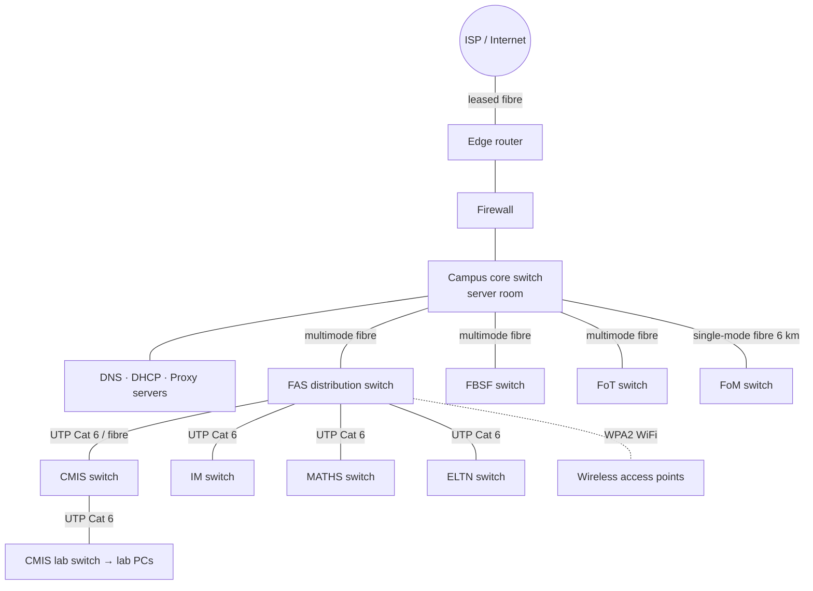
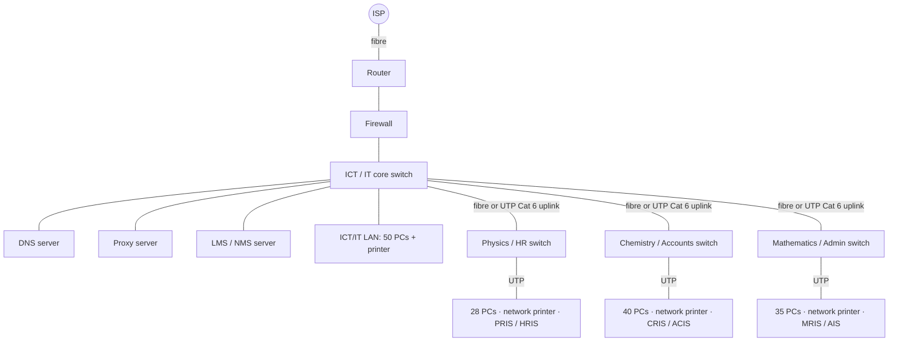
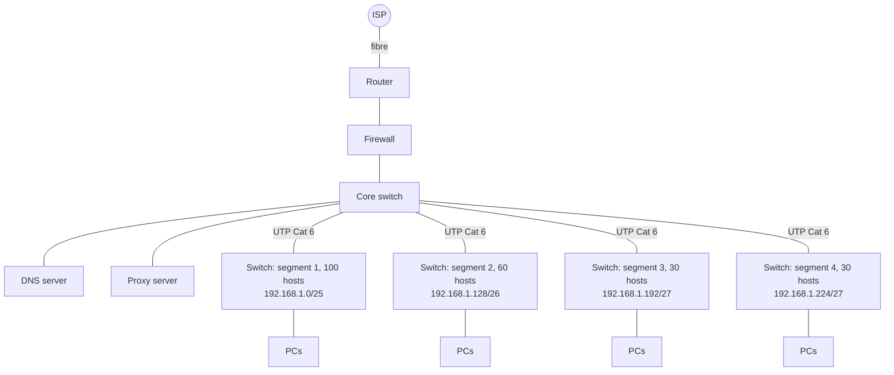

# PP 05.4 · Network Design Scenarios (topology + diagram + media + addressing)

> [!info] Lessons used: [[01.08 Network Topologies]] · [[01.09 Network Classification by Scale]] · [[02.01 Guided Transmission Media]] · [[05.09 Subnetting]] · [[08.01 Security Fundamentals, Cryptography and Firewalls]] · [[07.01 DNS]] · Map: [[3114 Past Paper Mapping]]
> ⚠️ DNS servers, proxy servers and firewalls are **not explained in the Chapter 1–5 slides**; the device descriptions use general networking knowledge. Topology, media and subnetting parts are lecture content.

| Paper | Q | Scenario |
|---|---|---|
| 2018/19 | 1(c) | Kuliyapitiya premises: four faculties (FoM 6 km away), FAS departments, CMIS lab; secure access; media with justification |
| 2019/20 | 8(a), (b) | Faculty: Physics, Chemistry, Mathematics, ICT; DNS, proxy, firewall; fibre ISP → topology + diagram (subnetting in [[PP 05.3 - IP Addressing and Subnetting]]) |
| 2022/23 | 8(a), (b) | Office: HR, Accounts, Administration, IT Service; same requirements |
| 2023/24 | 8(c) | The 4 segments of 192.168.1.0 with router, DNS, proxy, firewall, fibre ISP; connections, media, devices |

> [!tip] Universal answer checklist (examiners look for these)
> 1. **Topology named and justified** (hierarchical/tree = extended star).
> 2. **Every device named**: ISP link, edge router, firewall, core switch, department switches, servers (DNS, proxy, department servers), printers, PCs, WiFi APs.
> 3. **Every link labelled with its medium** and a **justification** (fibre between buildings/long distance; UTP Cat 6 inside buildings ≤ 100 m; WiFi for mobility).
> 4. **Security**: firewall at the Internet edge, proxy for web access/caching, WPA2 on WiFi, separate subnets (VLANs) per department.
> 5. **Addressing** consistent with the subnetting part.

---

## A. 2018/19 Q1(c): university premises
> **Question:** The Internet facilities at Kuliyapitiya premises are provided to four faculties, FAS, FBSF, FoT, FoM. Note here that FoM is 6 km away from the other 3 faculties. The Faculty of Applied Sciences (FAS) has four departments named as CMIS, IM, MATHS and ELTN. CMIS also has a computer laboratory. Draw a network diagram to facilitate the above configuration in a way that it provides secure network access to its users. Name the faculties, departments and any other components in your diagram and clearly mark the connections and type of media recommended with justification, considering the physical locations.

### Expected answer

**Explanation / justification:**
- **Topology:** **hierarchical (tree / extended star)**: a core switch connects each faculty's distribution switch, which connects department switches (each a star LAN). Easy to manage and expand; a fault in one department doesn't affect others.
- **FoM (6 km away): single-mode optical fibre** (or a leased fibre / microwave link if laying cable is impossible). **UTP is limited to ~100 m**; fibre has very low attenuation over kilometres, high bandwidth, and immunity to lightning/EMI between buildings.
- **Between faculty buildings on the same site: multimode fibre** (hundreds of metres, high bandwidth, no electrical interference between buildings).
- **Inside buildings (departments, CMIS lab): UTP Cat 5e/6** from switches to PCs: cheap, easy, enough for ≤ 100 m runs.
- **Security:** a **firewall** between the edge router and the campus network filters traffic; a **proxy server** controls and caches web access; **WPA2/WPA2-Enterprise** on WiFi; each faculty/department in its **own subnet/VLAN**; user authentication (login to the domain/LMS).
- **ISP connection:** fibre to the edge router in the main server room.

---

## B. 2019/20 Q8(a)(b): faculty network · 2022/23 Q8(a)(b): office network

> **2019/20 Q8:** A University faculty wants to computerize their existing departments through a new ICT department. Their requirements are as follows. *(Physics 28 computers, Network Printer, PRIS server · Chemistry 40, Network Printer, CRIS · Mathematics 35, Network Printer, MRIS · ICT 50, Printer, LMS.)* The faculty requires the following settings: Each department will have their own LAN which are interconnected via the ICT department. The network consists of a DNS server, a Proxy server and a firewall to serve and protect all computers. The ISP provides fiber Internet connectivity to the ICT Department.
> a) What is the most suitable network topology for the above network. Explain your answer.
> b) Draw a network diagram clearly showing the connections and devices of the above network.
>
> **2022/23 Q8:** An office wants to network their existing departments through a new IT Service department. *(HR 28 computers, Network Printer, HRIS · Accounts 40, Network Printer, ACIS · Administration 35, Network Printer, AIS · IT Service 50, Printer, NMS.)* Each department will have their own LAN which are interconnected via the IT Service department. The network consists of a DNS server, a Proxy server and a firewall to serve and protect all computers. The ISP provides fiber Internet connectivity to the IT Service Department.
> a) What is the most suitable network topology for the above network? Explain your answer.
> b) Draw a network diagram clearly showing the connections and naming devices of the above network.

### (a) Topology
**Hierarchical / tree topology (an extended star):** each department is a **star LAN** around its own switch, and every department switch connects to a **central core switch/router in the ICT (IT Service) department**, which also holds the shared servers and the single fibre Internet link.
Reasons: matches the requirement *"each department has its own LAN interconnected via the ICT department"*; **easy to manage and troubleshoot** (faults isolated to one department); **easy to expand** (add a department switch); central placement of **firewall, proxy and DNS** protects and serves everyone; each department can be its own **subnet** (the /26 blocks in Q8c).

### (b) Diagram

**Explain the diagram:**
- The **ISP's fibre** terminates on the **router** in the ICT/IT department; the **firewall** sits between the router and the internal network, filtering all traffic in and out.
- The **core switch** (layer-3 switch or router interfaces) interconnects the four department LANs and the server farm; each department is its **own subnet** (Physics/HR 192.168.14.0/26, Chemistry/Accounts .64/26, Maths/Admin .128/26, ICT/IT .192/26).
- **DNS server** resolves names for all computers; **proxy server** handles and caches web requests and enforces access policy; department servers (PRIS, CRIS, MRIS / HRIS, ACIS, AIS) and the **LMS/NMS** sit in their own LANs or the server area.
- **Media:** **fibre** for the ISP link (and for inter-building uplinks if departments are in separate buildings); **UTP Cat 5e/6** between switches and PCs/printers/servers (≤ 100 m).

---

## C. 2023/24 Q8(c)
> **Question:** The above network architecture in part (b) consists of a Router, DNS server, a Proxy server and a firewall to serve and protect all computers. The ISP provides fiber Internet connectivity. Draw a network diagram clearly showing the connections, the connection media used and devices of the above network. You may include additional devices where necessary.

### Expected answer

- **Devices:** ISP fibre → **router** (connects the LAN to the Internet and routes between the four subnets) → **firewall** → **core switch** with **DNS** and **proxy** servers → four **access switches**, one per segment, each serving its PCs (and optionally a **WiFi AP**).
- **Media:** **optical fibre** from the ISP (high bandwidth, long distance); **UTP Cat 6** for switch uplinks and PCs (≤ 100 m); fibre uplinks if a segment is in another building.
- **Addressing:** each segment uses its subnet from Q8(b); the router has an interface (gateway address) in each subnet.

### Exam approach for all design questions
Spend the first minute listing devices and media; draw neatly with **labels on every link**; then write 4–6 bullet points justifying the topology, media and security devices.
