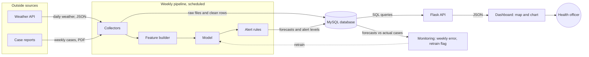

# 09.02 · Architecture Diagrams

> [!info] [[09.00 Documentation and Portfolio|Lesson 9]] · Roadmap Phase 9 · Priority 🟡 Supporting
> **Builds on:** [[02.06 Client-Server and Three-Tier Architecture]] · [[02.08 Web Application Architecture Components]]
> **Used for:** the one picture in the README and the report that shows how the parts of the system connect.

## 1. Definition
> [!note] Architecture diagram
> An **architecture diagram** is a drawing of a system's main **components** and the **connections** between them. It shows what the parts are and how data moves from one to the next.

## 2. Why it is used
- A reader understands a picture of six boxes faster than six paragraphs.
- Drawing it tests your own understanding: if you cannot draw the flow, you cannot explain it.
- Interviewers ask "walk me through the system". The diagram is your answer.

## 3. How it works: the rules
| Rule | Meaning |
|---|---|
| **One box per component** | A component is something that runs or stores: a script, a service, a database, a page |
| **Arrows show data flow** | The arrow points the way the data travels |
| **Label every arrow** | With what flows: "daily weather (JSON)", "forecasts" |
| **One level of detail** | Do not mix "the cloud" with "line 42 of features.py" |
| **Flow in one direction** | Left to right, or top to bottom |
| **A legend if shapes or colours differ** | Cylinder = database, rectangle = process |
| **Show the boundaries** | What is outside your system (data sources, users) and what is inside |

A useful habit is to draw at two levels:
1. **Context:** your system as one box, with the people and outside systems around it.
2. **Components:** inside that box, the parts and the flows.

## 4. Example: this project's architecture
Obsidian draws this diagram from the text below (Mermaid).

Reading it aloud, in the order the data moves: *"Each week a scheduled pipeline collects weather from an API and case counts from published reports. It builds features, runs the model and applies the alert rules. Forecasts and alert levels are stored in a database. A Flask API serves them as JSON to a dashboard, which a health officer reads. A monitoring step compares past forecasts with what actually happened and flags the model for retraining when the error grows."*

That paragraph, with the diagram, is the architecture section of your report.

## 5. Tools
| Tool | Good for |
|---|---|
| **Mermaid** | Diagrams written as text; drawn by Obsidian and by GitHub in a README; easy to keep in Git |
| **draw.io** (diagrams.net) | Free drag-and-drop; exports PNG and SVG |
| **Excalidraw** | A hand-drawn look; quick sketches |
| **Paper** | The first draft, always |

## 6. Other diagrams you may be asked for
| Diagram | Shows |
|---|---|
| **ER diagram** | Tables and their relationships: [[06.01 Relational Schema Design and Normalisation]] |
| **Flowchart** | The steps and decisions of one process |
| **Sequence diagram** | Messages between parts, in time order: "the browser asks the API, the API asks the database" |
| **Data-flow diagram** | How data moves and is transformed |
| **Deployment diagram** | Which software runs on which machine |

## 7. Common mistakes
- **Unlabelled arrows.** The reader cannot tell what moves.
- **Arrows in every direction,** crossing each other.
- **Mixed levels of detail.**
- **Logos instead of roles.** A reader may not recognise the icon; write "database".
- **Drawing what you planned, not what you built.** Update the diagram when the system changes.
- **Leaving out the outside world:** where the data comes from and who uses the result.
- **Leaving out the scheduler and the monitoring,** the two parts that make it a *system* and not a script.
- **Too many boxes.** More than about ten means you need two diagrams.
- **A diagram with no words beside it.** Always add the walk-through paragraph.

## 8. Exam and viva focus
- **Purpose of an architecture diagram.**
- **Component vs connector.**
- **Three-tier architecture:** presentation (dashboard), application or logic (Flask), data (database). See [[02.06 Client-Server and Three-Tier Architecture]].
- **Name three kinds of diagram** and what each shows: ER, sequence, data-flow.
- **Draw the architecture of a small web application** from a description.
- **Why separate the tiers?** Each can be changed, scaled and secured independently.

## Related
- [[02.06 Client-Server and Three-Tier Architecture]] · [[02.08 Web Application Architecture Components]] · [[06.01 Relational Schema Design and Normalisation]] · [[09.01 Technical and Scientific Writing]] · [[09.03 Presenting and Storytelling]] · [[04. Concepts/Machine Learning/Machine Learning Pipeline|Machine Learning Pipeline]]
